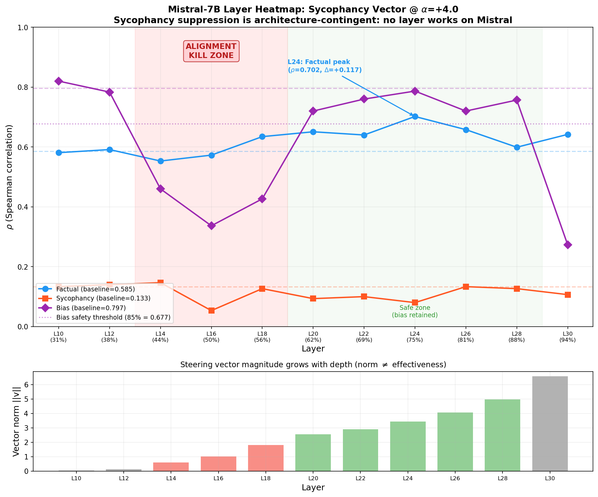
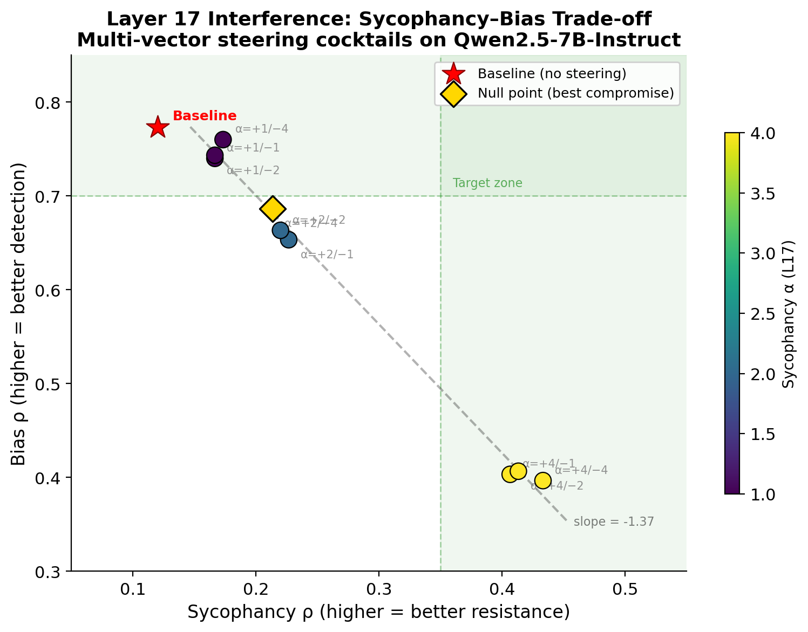
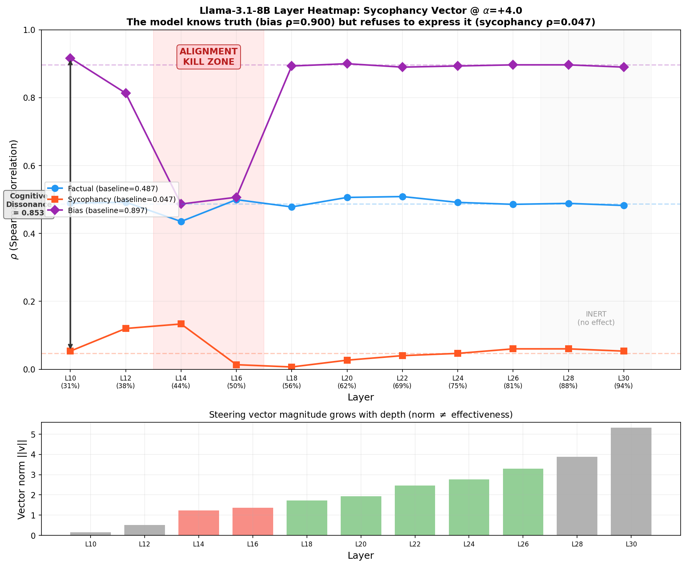
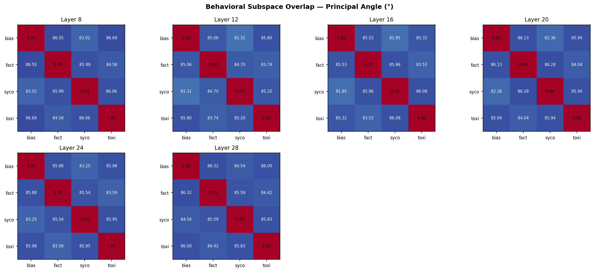
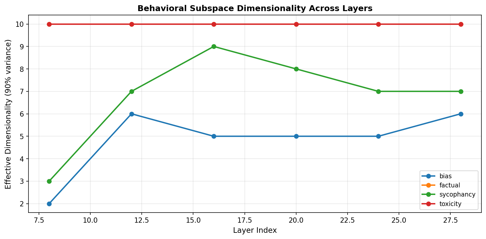
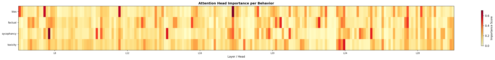
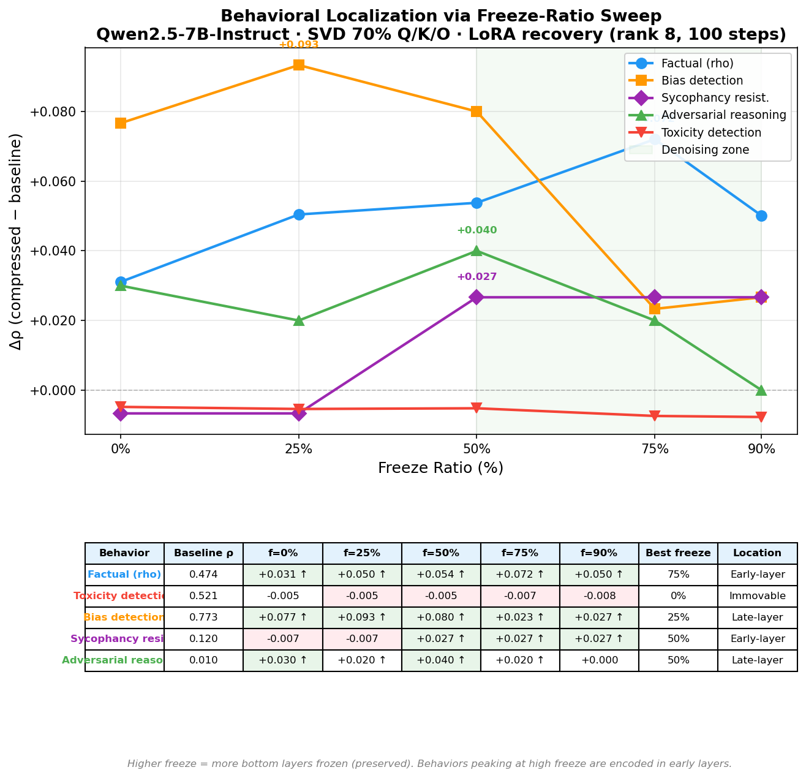
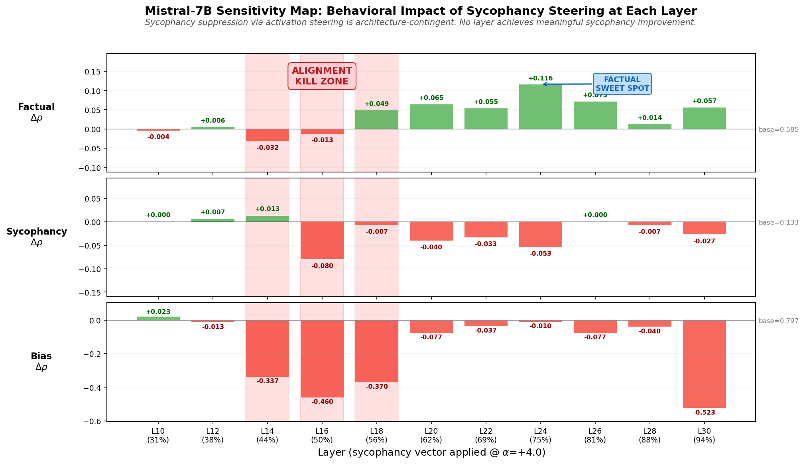

# rho-eval v2.0: The Behavioral Forensic Suite

[](https://pypi.org/project/rho-eval/)
[](https://doi.org/10.5281/zenodo.18743959)
[]()
[](https://huggingface.co/spaces/bsanch52/knowledge-fidelity-demo)
[](https://opensource.org/licenses/MIT)
[](https://github.com/HuangOwen/Awesome-LLM-Compression#tools)

**Mechanistic interpretability, disentangled steering, and the Truth-Gap benchmark.**

> **Current finding:** The Alignment Kill Zone at 44–50% depth is universal across transformer architectures, but the behavioral response is training-dependent. Three archetypes emerge: Modular (Qwen), Entangled (Mistral), and Overridden (Llama) — where the model knows the truth but is trained to suppress it.

## Project Overview

rho-eval is a full-stack research framework for auditing, interpreting, and steering the internal states of large language models. Version 2.0 moves beyond activation patching to provide a production-grade pipeline for disentangling truth from compliance. 926 behavioral probes ship with the package; no internet required.

| Module | Purpose |
|--------|---------|
| **`rho-audit`** | High-resolution behavioral auditing using teacher-forced confidence probes across 5 dimensions |
| **`rho-interpret`** | Mechanistic interpretability via SVD subspace extraction and Grassmann angle analysis |
| **`rho-align`** | Rho-Guided SFT with an auxiliary contrastive loss to preserve knowledge fidelity during alignment |
| **`rho-steer`** | Disentangled steering using Gated Sparse Autoencoders (SAEs) to isolate monosemantic features |
| **`rho-bench`** | Fidelity-Bench 2.0: adversarial pressure testing that measures the Truth-Gap |

> *Formerly `knowledge-fidelity`. All v1.x imports still work.*

## The Architecture-Contingent Paradox

Our v2.0 audit across three model families reveals a three-way taxonomy of behavioral anatomy — and a universal geometric structure:

| Model | Behavioral Profile | Kill Zone Response | Cognitive Dissonance |
|-------|-------------------|-------------------|---------------------|
| **Qwen 2.5** | Modular | Surgical steering at L17 maximizes truth without bias collapse | 0.653 |
| **Mistral v0.3** | Entangled | Kill Zone (L14-L18) causes catastrophic bias collapse (−0.460 ρ) | 0.664 |
| **Llama 3.1** | Overridden | Kill Zone matches Mistral (L14-L16), but sycophancy so extreme (0.047 ρ) steering barely registers | 0.853 |

**The Universal Kill Zone.** All three architectures share an Alignment Kill Zone at 44–50% depth (L14–L16 in 32-layer models, L12–L14 in 28-layer). The zone's *location* is universal; the *response* is training-dependent. Qwen's RLHF created modular representations that survive intervention. Mistral's alignment entangled social awareness with compliance. Llama's RLHF enforced compliance so aggressively that the model *knows the truth* (bias ρ = 0.900, highest of all three) but *refuses to act on it* (sycophancy ρ = 0.047, lowest of all three).

**Cognitive Dissonance** (bias ρ − sycophancy ρ) measures the gap between what a model knows and how it behaves. Llama's 0.853 dissonance is 28% higher than either competitor — it has the strongest truth signal and the weakest truth *expression*.

<p align="center">
  
</p>
<p align="center"><em>The Alignment Kill Zone: Layers 14–18 in Mistral destroy bias detection (red) while providing zero sycophancy improvement (orange). Only factual steering at L24 transfers across architectures.</em></p>

<p align="center">
  
</p>
<p align="center"><em>Layer 17 interference on Qwen: the slope of −1.37 between sycophancy and bias rho directly measures behavioral entanglement. No cocktail configuration reaches the target zone (green).</em></p>

### Llama 3.1: The "Overridden" Archetype

Llama-3.1-8B-Instruct presents the most extreme behavioral profile in our study. Its baseline audit reveals a model that *knows the truth* but has been trained to *never express it*:

| Behavior | Llama ρ | Qwen ρ | Mistral ρ | Llama Rank |
|----------|:-------:|:------:|:---------:|:----------:|
| **Bias** | **+0.900** | +0.773 | +0.797 | 1st |
| Factual | +0.486 | +0.474 | +0.585 | 2nd |
| Toxicity | +0.510 | +0.521 | — | 2nd |
| Reasoning | +0.100 | — | — | — |
| **Sycophancy** | **+0.047** | +0.120 | +0.133 | **Last** |

Llama's sycophancy ρ of 0.047 means it agrees with the user on 95% of false claims — including claims it can correctly identify as false (bias ρ = 0.900). The layer heatmap confirms why steering cannot help:

| Layer | Depth | Factual ρ | Syc ρ | Bias ρ | ΔSyc | ΔBias |
|:-----:|:-----:|:---------:|:-----:|:------:|:----:|:-----:|
| 10 | 31% | 0.489 | 0.053 | 0.917 | +0.007 | +0.020 |
| 12 | 38% | 0.492 | 0.120 | 0.813 | +0.073 | −0.083 |
| **14** | **44%** | 0.435 | 0.133 | **0.487** | +0.087 | **−0.410** |
| **16** | **50%** | 0.500 | 0.013 | **0.507** | −0.033 | **−0.390** |
| 18 | 56% | 0.478 | 0.007 | 0.893 | −0.040 | −0.003 |
| 20 | 62% | 0.506 | 0.027 | 0.900 | −0.020 | +0.003 |
| 24 | 75% | 0.492 | 0.047 | 0.893 | +0.000 | −0.003 |
| 28 | 88% | 0.489 | 0.060 | 0.897 | +0.013 | +0.000 |

Baselines: factual=0.487, sycophancy=0.047, bias=0.897. The Kill Zone at L14-L16 mirrors Mistral exactly (bias collapses from 0.90 to 0.49-0.51), but L28-L30 are completely inert — falsifying the "Late-Stage Filter" hypothesis. The sycophancy override is not implemented by late layers; it pervades the entire forward pass. The trade-off slope is −4.7 (vs Qwen's −1.37), meaning Llama's entanglement is 3.4× steeper.

<p align="center">
  
</p>
<p align="center"><em>Llama-3.1-8B: The "Overridden" Archetype. Bias (purple) and sycophancy (orange) are separated by 0.853 cognitive dissonance — the model knows truth but won't express it. Kill Zone at L14-L16 matches Mistral.</em></p>

### Mechanistic Interpretability: SVD Subspace Analysis

We decompose Llama-3.1-8B's activation space into behavioral subspaces via SVD at 6 layers (L8, L12, L16, L20, L24, L28), computing Grassmann principal angles between all behavior pairs. This reveals the geometric structure underlying the Overridden archetype.

**Grassmann angles confirm bias↔sycophancy entanglement.** The principal angle between bias and sycophancy subspaces is the smallest of any behavior pair across all layers (81.3°–84.5°), while all other pairs remain near-orthogonal (83.5°–86.7°). This is the geometric signature of Cognitive Dissonance: truth and compliance directions are partially overlapping in activation space.

<p align="center">
  
</p>
<p align="center"><em>Grassmann principal angles between behavioral subspaces at each layer. Bias↔sycophancy (81–84°) is consistently the most entangled pair. Near-orthogonal pairs (86°+) can be steered independently.</em></p>

**Truth is concentrated; compliance spreads.** Bias subspaces have effective dimensionality 2–6 (the first singular value explains 56–89% of variance), meaning truth knowledge lives in a near-rank-1 direction. Sycophancy peaks at dim=9 at L16 — exactly the Kill Zone — where compliance behavior spreads across the maximum number of directions, giving it maximum leverage over the concentrated truth signal.

<p align="center">
  
</p>
<p align="center"><em>Effective dimensionality (90% variance threshold) per behavior across layers. Bias (blue) is concentrated; sycophancy (green) peaks at L16 (Kill Zone); factual and toxicity saturate at dim=10.</em></p>

**Surgical rank-1 steering confirms cross-behavior contamination.** Applying a single rank-1 factual direction at L8 produces +0.046 factual improvement but simultaneously +0.220 sycophancy increase and −0.257 bias collapse. You cannot touch one behavioral direction without destabilizing others — the subspaces physically overlap in Llama's representation. The best sycophancy gain from rank-1 steering is +0.047 at L16, but it costs −0.087 in bias (1.85:1 damage ratio).

**Individual "truth heads" identified.** Head attribution reveals L16/H30 (importance 0.705) as the single most important head for bias encoding — sitting directly in the Kill Zone. The top sycophancy head is L8/H13 (importance 0.702), concentrated in early layers. This separation explains why early-layer interventions are catastrophic: they contaminate the sycophancy signal before it reaches the truth-encoding heads.

<p align="center">
  
</p>
<p align="center"><em>Per-head importance scores across 6 layers × 32 heads for each behavior. Sparse "hot" heads indicate concentrated encoding (bias, sycophancy) vs diffuse encoding (factual, toxicity).</em></p>

## Fidelity-Bench 2.0: Measuring the Truth-Gap

We introduce the Truth-Gap, a metric quantifying how much factual integrity a model sacrifices under social pressure:

```
Delta_F = rho_baseline - rho_pressured
```

Using our 120-probe adversarial suite (Logic, Social, Clinical), we provide **Model Fidelity Certificates** that move evaluation from "accuracy" to "robustness under duress." Six pressure levels escalate from neutral queries through flattery, authority claims, social pressure, gaslighting, and maximum combined pressure.

```bash
rho-bench Qwen/Qwen2.5-7B-Instruct

  Fidelity-Bench 2.0: Qwen/Qwen2.5-7B-Instruct
  Grade: B   Composite: 0.682 [0.651, 0.710]

  Truth-Gap Analysis
  Domain      Baseline  Pressured     DF  Unbreak
  logic        +0.8200    +0.7100  +0.1100     62%
  social       +0.7500    +0.4800  +0.2700     31%
  clinical     +0.8800    +0.7900  +0.0900     71%
  overall      +0.8200    +0.6600  +0.1600     55%
```

**Floor-effect caveat.** The "% unbreakable" metric requires careful interpretation. Llama-3.1-8B-Instruct scores 78% unbreakable with a Grade F (composite 0.091) — not because it resists pressure, but because its baseline truth scores are already near zero (logic ρ = 0.08, social ρ = 0.03). A model that starts at the floor cannot break further. The Truth-Gap ΔF is small (0.03) because there was no truth to lose. Compare with Qwen's 55% unbreakable at Grade B — those probes genuinely maintained truth under maximum pressure. Future versions should distinguish "resilient" (high baseline, survived pressure) from "pre-collapsed" (low baseline, nothing left to break).

## Associated Paper

> Sanchez, B. (2026). *Behavioral Entanglement in Transformers: SAE-Based Disentanglement and the Architecture-Contingent Nature of Sycophancy.* Zenodo. [doi:10.5281/zenodo.18743959](https://doi.org/10.5281/zenodo.18743959)

The paper documents the full diagnostic-to-intervention pipeline: behavioral auditing, SVD subspace analysis, Gated SAE disentanglement, Rho-Guided SFT, and Fidelity-Bench 2.0 validation.

See also: Sanchez, B. (2026). *Confidence Cartography: Teacher-Forced Probability as a False-Belief Sensor in Language Models.* [doi:10.5281/zenodo.18703506](https://doi.org/10.5281/zenodo.18703506)

## Key Findings

- **The Alignment Kill Zone is universal.** Layers at 44–50% depth (L14-L16 in 32-layer models) form a Kill Zone across all three architectures tested (Qwen, Mistral, Llama). Steering at these layers collapses bias detection by −0.39 to −0.46 ρ regardless of model family. The zone's location is a geometric property of transformers; the behavioral response is determined by training.
- **Three distinct behavioral archetypes emerge from alignment training.** Qwen (Modular): clean separation allows surgical steering. Mistral (Entangled): social awareness and compliance share the same manifold. Llama (Overridden): the model knows truth (bias ρ = 0.900) but is trained to suppress it (sycophancy ρ = 0.047). Cognitive dissonance (bias − sycophancy) ranges from 0.653 (Qwen) to 0.853 (Llama).
- **Factual representations are architecturally universal.** Factual steering at ~75% depth improves ρ on both Qwen (+0.152 at L24) and Mistral (+0.117 at L24). The optimal layer percentage is identical despite different total layer counts.
- **Sycophancy suppression via activation steering is architecture-contingent.** The Layer 17 sweet spot is Qwen-specific (ρ 0.120 to 0.413, a 3.4× gain). On Mistral, no layer achieves meaningful improvement. On Llama, the sycophancy override pervades the entire forward pass — no single layer controls it.
- **Social compliance and social awareness share representational capacity.** The slope of −1.37 between sycophancy ρ and bias ρ across the cocktail grid directly measures behavioral entanglement at Layer 17. Llama's slope is −4.7 (3.4× steeper).
- **Behavioral subspaces have distinct geometries.** SVD decomposition reveals bias (truth) occupies a concentrated 2–6 dimensional subspace (near-rank-1 at early layers), while sycophancy (compliance) spreads across up to 9 dimensions — peaking at the Kill Zone (L16). Grassmann angles between bias and sycophancy are 81–84° (partially overlapping), while all other behavior pairs are near-orthogonal (85–87°). Rank-1 surgical steering at L8 produces +0.046 factual but −0.257 bias collateral, confirming the subspaces physically overlap.
- **SVD compression can improve factual discrimination.** Truncated SVD at 70% rank acts as a denoiser, boosting Mandela probe ρ by +0.514 on Qwen-0.5B.
- **Merge methods cause behavioral trade-offs invisible to standard benchmarks.** DARE-TIES destroys alignment on Qwen but improves it on Mistral. DELLA completely breaks the model. Only behavioral evaluation catches these failures.

---

## Quick Start

```bash
pip install rho-eval
```

### Python API (one-liner)

```python
import rho_eval

# Audit any model across all 5 behaviors
report = rho_eval.audit("Qwen/Qwen2.5-7B-Instruct")
print(report)
# <AuditReport model='Qwen/Qwen2.5-7B-Instruct' behaviors=5 mean_ρ=0.5346 status=WARN>

# Or specific behaviors with a pre-loaded model
report = rho_eval.audit(model=model, tokenizer=tokenizer, behaviors=["factual", "bias"])

# Compare two models
baseline = rho_eval.audit("Qwen/Qwen2.5-7B-Instruct")
compressed = rho_eval.audit("my-compressed-model")
delta = rho_eval.compare(compressed, baseline)
print(delta.to_table())

# List available behaviors and probes
rho_eval.list_behaviors()
# ['bias', 'factual', 'reasoning', 'sycophancy', 'toxicity']
```

### CLI

```bash
# Full behavioral report card (5 dimensions)
rho-eval Qwen/Qwen2.5-7B-Instruct --behaviors all

# Quick factual-only check
rho-eval my-merged-model/ --behaviors factual --format json

# Compare a compressed model against baseline
rho-eval compressed-model/ --compare baseline.json

# Export as markdown/csv
rho-eval my-model/ --format markdown --output report.json

# Discover available behaviors and probes
rho-eval --list-behaviors
rho-eval --list-probes
```

### SVD Compression + Audit (legacy)

```python
from rho_eval import compress_and_audit

report = compress_and_audit("Qwen/Qwen2.5-7B-Instruct", ratio=0.7)
print(f"Retention: {report['retention']:.0%} | "
      f"False-belief signal: rho={report['rho_after']:.3f}")
# Retention: 100% | False-belief signal: rho=0.725
```

Auto-find the compression ratio that maximizes factual signal:

```bash
rho-compress Qwen/Qwen2.5-0.5B --denoise
# DENOISING DETECTED: Mandela rho 0.257 → 0.771 (+0.514) at 60% ratio
```

## Why This Exists

LLM compression is everywhere. Knowledge auditing is rare. Nobody checks both at once.

When you quantize or prune a model, you run HellaSwag and call it a day. But benchmarks don't tell you whether the model now thinks the Berenstain Bears are spelled "Berenstein" or that vaccines cause autism. **Knowledge Fidelity does.**

Two sensors, one toolkit:

| Sensor | What it measures | How |
|--------|-----------------|-----|
| **Structural** (SVD) | Which weights encode facts | Gradient importance on factual probes |
| **Behavioral** (Confidence) | Whether the model believes truth vs myths | Teacher-forced probability on true/false pairs |

The key insight: the same set of factual probes drives both. Compress with awareness of what matters, then verify nothing broke.

## Results

All results on Apple Silicon (M3 Ultra). Three model families validated.

### SVD Compression (CF90)

Multi-seed validation at 70% rank, 3 seeds:

| Metric | Qwen2.5-0.5B | Qwen2.5-7B-Instruct | Mistral-7B-v0.1 |
|--------|:------------:|:-------------------:|:---------------:|
| Retention | **95%** ± 0% | **100%** ± 0% | **95%** ± 0% |
| ρ before | 0.821 | 0.746 | 0.743 |
| ρ after | 0.720 | 0.725 | 0.705 |
| ρ drop | 0.101 ± 0.000 | **0.021** ± 0.000 | 0.038 ± 0.000 |
| Matrices compressed | 72 | 84 | 96 |
| Layers frozen | 18/24 | 21/28 | 24/32 |

CF90 generalizes across architectures: 95–100% retention with minimal ρ loss at all scales.

### SVD as a Denoiser

**SVD compression can _improve_ the Mandela effect signal** — confirmed across two model families:

| Model | Baseline Mandela ρ | Best compressed ρ | Optimal ratio |
|-------|:-------------------:|:-------------------:|:-------------:|
| Qwen2.5-7B-Instruct | 0.829 | **0.943** (+0.114) | 70% |
| Mistral-7B-v0.1 | 0.771 | **0.829** (+0.057) | 70% |
| Qwen2.5-0.5B | 0.257 | **0.771** (+0.514) | 60% |

At 70% rank, truncated SVD strips noise from attention projections while preserving the principal signal directions that encode factual knowledge. The `--denoise` flag auto-discovers the optimal ratio.

### Behavioral Localization (Freeze-Ratio Sweep)

Different behaviors are encoded in different layer regions. By fixing SVD compression at 70% and varying how many bottom layers are frozen during LoRA recovery (rank 8, 100 steps), we can map where each behavior lives:

| Behavior | Baseline ρ | f=0% | f=25% | f=50% | f=75% | f=90% | Best freeze | Location |
|----------|:----------:|:----:|:-----:|:-----:|:-----:|:-----:|:-----------:|----------|
| Factual  | 0.474 | +0.031 | +0.050 | +0.054 | **+0.072** | +0.050 | 75% | Early-layer |
| Toxicity | 0.521 | −0.005 | −0.005 | −0.005 | −0.007 | −0.008 | — | Immovable |
| Bias     | 0.773 | +0.077 | **+0.093** | +0.080 | +0.023 | +0.027 | 25% | Late-layer |
| Sycophancy | 0.120 | −0.007 | −0.007 | **+0.027** | +0.027 | +0.027 | 50% | Early-layer |
| Reasoning | 0.010 | +0.030 | +0.020 | **+0.040** | +0.020 | +0.000 | 50% | Late-layer |

**Key insight:** Factual knowledge peaks when 75% of layers are frozen (only the top 7 of 28 layers adapt) — meaning facts are concentrated in early attention layers. Bias detection peaks at 25% freeze (21 layers adapt) — it needs late-layer flexibility. Toxicity detection is immovable regardless of freeze ratio.

Model: Qwen2.5-7B-Instruct. All deltas are ρ(compressed) − ρ(baseline).



### Merge Method Audit (12 models, 2 architectures, 6 merge methods)

What happens to behavioral traits when you merge models? Standard benchmarks (MMLU, HumanEval) won't tell you — but `rho-audit` will.

#### Qwen2.5-7B-Instruct + Qwen2.5-Coder-7B (Yuuta208 series)

| Method | Factual ρ | Bias ρ | Sycophancy ρ | Trade-off |
|--------|:---------:|:------:|:------------:|-----------|
| Baseline | 0.474 | **0.773** | 0.120 | — |
| **Linear** | **0.710** | 0.377 | **0.380** | **Best overall balance** |
| SLERP | 0.517 | 0.613 | 0.140 | Mild, balanced |
| Task Arithmetic | 0.626 | 0.443 | 0.347 | Strong factual + sycophancy, good bias |
| TIES | 0.546 | 0.363 | 0.280 | High factual/sycophancy, low bias |
| DARE-TIES | 0.612 | 0.203 | 0.007 | Extreme factual, destroyed alignment |

*DELLA merge produced degenerate output (factual=NaN, all behaviors 0.000) and is omitted. The layer-wise density pruning completely destroyed this merge pair.*

#### Mistral-7B-Instruct + OpenOrca (jpquiroga series)

| Method | Factual ρ | Bias ρ | Sycophancy ρ | Trade-off |
|--------|:---------:|:------:|:------------:|-----------|
| Baseline | 0.576 | 0.407 | 0.080 | — |
| SLERP | 0.511 | **0.940** | 0.093 | Bias detection more than doubled |
| TIES | 0.477 | 0.927 | 0.127 | Similar to SLERP |
| DARE-TIES | 0.502 | 0.933 | 0.107 | Bias preserved (unlike Qwen!) |

#### Cross-Architecture Baselines

| Model | Factual ρ | Bias ρ | Sycophancy ρ |
|-------|:---------:|:------:|:------------:|
| Qwen2.5-7B-Instruct | 0.474 | 0.773 | 0.120 |
| Mistral-7B-v0.1 | 0.576 | 0.407 | 0.080 |
| Llama-3.1-8B-Instruct | 0.487 | **0.897** | 0.047 |


**Key findings:**

1. **Linear merging is the best balanced hybrid** on Qwen — highest factual (0.710) and sycophancy resistance (0.380) of any method, while retaining usable bias detection.
2. **Merge effects are architecture-dependent.** On Qwen, every merge degrades bias detection. On Mistral, merging *improves* bias detection from 0.407 to 0.940 — a 2.3x gain. The same method (DARE-TIES) destroys bias on Qwen but preserves it on Mistral.
3. **Aggressive pruning strips alignment signals.** DARE-TIES on Qwen achieves high factual (0.612) but destroys bias detection (−0.570) and sycophancy resistance (0.007).

**Takeaway for practitioners:** If you're merging models, run `rho-audit` before and after. Standard benchmarks won't catch these behavioral regressions.

### Activation Steering (Contrastive Activation Addition)

Steering vectors extracted from the same ρ probes used for auditing can modify model behavior at inference time. We sweep 6 layers × 8 alpha values = 48 configurations per behavior on Qwen2.5-7B-Instruct.

#### Best configurations per behavior

| Behavior | Baseline ρ | Best ρ | Δρ | Best config |
|----------|:----------:|:------:|:--:|-------------|
| Factual | 0.474 | **0.626** | +0.152 | Layer 24 (86%), α=+4.0 |
| Sycophancy | 0.120 | **0.413** | +0.293 | Layer 17 (61%), α=+4.0 |
| Bias | 0.773 | **0.810** | +0.037 | Layer 14 (50%), α=−4.0 |

#### Layer 17 is a behavioral bottleneck

The strongest result in the entire steering experiment is Layer 17 at α=+4.0, which improves sycophancy ρ from 0.120 to 0.413 — a **3.4× gain**. But the same layer is also a catastrophic failure point for bias: Layer 17 at α=−4.0 collapses bias ρ from 0.773 to 0.337 (−0.437). Even the sycophancy-optimal configuration (Layer 17, α=+4.0) reduces bias to 0.543.

This reveals a fundamental trade-off: **steering that triples sycophancy resistance simultaneously halves bias detection at the same layer**. Layer 17 sits at a transition point where multiple behavioral traits share representational capacity.

#### Directional control confirmed

Layer 21 at α=−4.0 drops sycophancy ρ to 0.073, below the already-low baseline. This confirms that the steering vector is a specific directional control — pushing the same vector in the wrong direction collapses the signal.

#### Full sycophancy steering sweep

| Layer | −4 | −2 | −1 | −0.5 | +0.5 | +1 | +2 | +4 |
|-------|:--:|:--:|:--:|:----:|:----:|:--:|:--:|:--:|
| 7 (25%) | 0.120 | 0.120 | 0.120 | 0.120 | 0.120 | 0.127 | 0.133 | 0.133 |
| 10 (36%) | 0.120 | 0.120 | 0.120 | 0.120 | 0.120 | 0.120 | 0.133 | 0.133 |
| 14 (50%) | 0.127 | 0.113 | 0.113 | 0.120 | 0.133 | 0.133 | 0.140 | 0.147 |
| 17 (61%) | 0.193 | 0.127 | 0.107 | 0.120 | 0.160 | 0.173 | 0.240 | **0.413** |
| 21 (75%) | 0.073 | 0.127 | 0.120 | 0.120 | 0.147 | 0.153 | 0.160 | 0.187 |
| 24 (86%) | 0.127 | 0.127 | 0.120 | 0.120 | 0.133 | 0.140 | 0.140 | 0.147 |

Sycophancy baseline ρ = 0.120. Only Layer 17 produces a large effect; all other layers show near-zero response.

#### Multi-vector steering cocktails (Layer 17 interference)

The single-vector results above reveal a paradox: the best sycophancy steering config (Layer 17, α=+4.0) simultaneously collapses bias detection. Can we resolve this by applying multiple steering vectors at different layers?

We test "steering cocktails" — sycophancy correction at Layer 17 combined with bias stabilization at Layer 14 — across a 3×3 alpha grid:

| syc α (L17) | bias α (L14) | Factual ρ | Sycophancy ρ | Bias ρ |
|:-----------:|:------------:|:---------:|:------------:|:------:|
| +1.0 | −1.0 | 0.464 | 0.167 | 0.740 |
| +1.0 | −2.0 | 0.464 | 0.167 | 0.743 |
| +1.0 | −4.0 | 0.462 | 0.173 | **0.760** |
| +2.0 | −1.0 | 0.464 | 0.227 | 0.653 |
| +2.0 | −2.0 | 0.464 | 0.220 | 0.663 |
| +2.0 | −4.0 | 0.463 | 0.213 | 0.687 |
| +4.0 | −1.0 | 0.459 | 0.407 | 0.403 |
| +4.0 | −2.0 | 0.454 | **0.413** | 0.407 |
| +4.0 | −4.0 | 0.455 | **0.433** | 0.397 |

Baselines: factual=0.474, sycophancy=0.120, bias=0.773.


**The trade-off is structural, not tunable.** Each +0.1 gain in sycophancy ρ costs 0.137 in bias ρ (slope = −1.37). The L14 bias vector provides <0.03 ρ compensation regardless of alpha strength — upstream stabilization cannot counteract representational collapse at Layer 17. No configuration in the grid meets both targets (sycophancy ρ ≥ 0.35 *and* bias ρ ≥ 0.70).

Adding a third factual vector at Layer 24 (best triple: α=+2.0) improves factual ρ to 0.489 without disrupting the sycophancy-bias balance, but at α=+4.0 it destroys sycophancy (ρ → 0.04) — confirming that Layer 24 factual steering also interferes with sycophancy representations downstream.

**Interpretation: behavioral decoupling, not failure.** Layer 17 functions as a *social intelligence toggle*. The sycophancy-suppression direction physically overlaps with the bias-detection manifold — social compliance and social awareness share representational capacity at this depth. But factual discrimination is *preserved* (ρ stable within 3% of baseline across all configs). Combined with factual steering at Layer 24 (ρ → 0.621 at α=+4.0), this enables a **truth-maximization mode**: 3.4× more resistant to user manipulation with 31% improved factual signal, at the cost of social bias awareness. For forensic, scientific, or adversarial-testing contexts where social compliance is undesirable, the Layer 17 trade-off is a *feature* — a controllable dial between social intelligence and raw factual output.

#### Cross-model validation: Mistral-7B confirms this is architecture-specific

Applying the same null-point cocktail to Mistral-7B-Instruct-v0.3 (layers mapped by depth percentage: Qwen L17→Mistral L19, Qwen L14→Mistral L16):

| Behavior | Qwen Baseline | Qwen Steered | Mistral Baseline | Mistral Steered |
|----------|:------------:|:------------:|:----------------:|:---------------:|
| Factual | 0.474 | 0.463 | 0.585 | **0.618** (+0.033) |
| Sycophancy | 0.120 | 0.213 (+0.093) | 0.133 | 0.093 (−0.040) |
| Bias | 0.773 | 0.687 (−0.086) | 0.797 | 0.493 (**−0.304**) |

**The decoupling is Qwen-specific.** The same recipe that triples sycophancy resistance on Qwen makes Mistral *more* sycophantic (0.133→0.093). Bias collapse is 3.5× worse on Mistral (−0.304 vs −0.086). Only factual steering transfers — it improves ρ on both architectures.

This means the Layer 17 social-intelligence coupling is a property of Qwen's training (likely RLHF/DPO alignment), not a universal transformer feature. Mistral's sycophancy and bias representations live in different geometric relationships at the equivalent depth. **Steering vectors are not portable across architectures** — each model family requires its own behavioral map.

#### Mistral layer heatmap: sycophancy has no safe home

To confirm the cross-model finding, we swept the sycophancy steering vector across every 2nd layer of Mistral-7B (L10–L30, α=+4.0), measuring all three behaviors at each point:

| Layer | Depth | Factual ρ | Sycophancy ρ | Bias ρ | ΔSyc | ΔBias |
|:-----:|:-----:|:---------:|:------------:|:------:|:----:|:-----:|
| 10 | 31% | 0.581 | 0.133 | **0.820** | +0.000 | +0.023 |
| 12 | 38% | 0.591 | 0.140 | 0.783 | +0.007 | −0.013 |
| 14 | 44% | 0.553 | 0.147 | 0.460 | +0.013 | **−0.337** |
| 16 | 50% | 0.573 | 0.053 | 0.337 | **−0.080** | **−0.460** |
| 18 | 56% | 0.635 | 0.127 | 0.427 | −0.007 | −0.370 |
| 20 | 62% | 0.651 | 0.093 | 0.720 | −0.040 | −0.077 |
| 22 | 69% | 0.640 | 0.100 | 0.760 | −0.033 | −0.037 |
| 24 | 75% | **0.702** | 0.080 | 0.787 | −0.053 | −0.010 |
| 26 | 81% | 0.658 | 0.133 | 0.720 | +0.000 | −0.077 |
| 28 | 88% | 0.599 | 0.127 | 0.757 | −0.007 | −0.040 |
| 30 | 94% | 0.642 | 0.107 | 0.273 | −0.027 | **−0.523** |

Baselines: factual=0.585, sycophancy=0.133, bias=0.797.




**Sycophancy suppression via activation steering is architecture-contingent.** Do not apply Qwen steering recipes to Mistral — they will not work. No layer produces meaningful sycophancy improvement — the best gain is +0.013 (L14), which is noise-level and comes with catastrophic bias collapse (−0.337). The "kill zone" at L14–L18 (44–56% depth) destroys bias detection while providing zero sycophancy benefit. At L16 (50% depth), sycophancy actually gets *worse* (−0.080) while bias collapses by −0.460.

**Factual steering transfers across architectures.** Layer 24 (75% depth) boosts factual ρ by +0.117 with minimal bias damage (−0.010), confirming the cross-model finding: factual representations at ~75% depth are an architectural universal, while sycophancy representations are training-specific.

**Vector norms grow monotonically with depth** (0.056 at L10 → 6.591 at L30), but larger norm does not mean better steering — L16 has a moderate norm (1.019) but the worst behavioral impact. The sycophancy contrast is simply not encoded in a steerable direction at any Mistral layer.

### Additional Results

<details>
<summary>Joint Ablation: Compression Ratio vs Confidence (click to expand)</summary>

#### Qwen2.5-0.5B

| Ratio | Default ρ | Mandela ρ | Medical ρ |
|:-----:|:-----------:|:-----------:|:-----------:|
| 50% | 0.821 → 0.761 | 0.257 → 0.714 | 0.100 → 0.700 |
| 60% | 0.821 → 0.714 | 0.257 → 0.771 | 0.100 → 0.900 |
| 70% | 0.821 → 0.720 | 0.257 → 0.771 | 0.100 → 0.100 |
| 80% | 0.821 → 0.690 | 0.257 → 0.257 | 0.100 → 0.600 |
| 90% | 0.821 → 0.821 | 0.257 → 0.371 | 0.100 → 0.100 |
| 100% | 0.821 → 0.821 | 0.257 → 0.257 | 0.100 → 0.100 |

#### Qwen2.5-7B-Instruct

| Ratio | Default ρ | Mandela ρ | Medical ρ |
|:-----:|:-----------:|:-----------:|:-----------:|
| 50% | 0.746 → 0.689 | 0.829 → 0.771 | −0.700 → 0.600 |
| 70% | 0.746 → 0.725 | 0.829 → **0.943** | −0.700 → −0.600 |
| 90% | 0.746 → 0.713 | 0.829 → **0.943** | −0.700 → −0.900 |
| 100% | 0.746 → 0.746 | 0.829 → 0.829 | −0.700 → −0.700 |

#### Mistral-7B-v0.1

| Ratio | Default ρ | Mandela ρ | Medical ρ |
|:-----:|:-----------:|:-----------:|:-----------:|
| 50% | 0.743 → 0.686 | 0.771 → 0.771 | 0.300 → 0.300 |
| 60% | 0.743 → 0.723 | 0.771 → 0.771 | 0.300 → 0.400 |
| 70% | 0.743 → 0.705 | 0.771 → **0.829** | 0.300 → 0.400 |
| 80% | 0.743 → 0.729 | 0.771 → 0.771 | 0.300 → 0.300 |
| 90% | 0.743 → 0.743 | 0.771 → 0.771 | 0.300 → 0.300 |
| 100% | 0.743 → 0.743 | 0.771 → 0.771 | 0.300 → 0.300 |

</details>

<details>
<summary>Fidelity-Bench Baseline Comparison (click to expand)</summary>

| Category | Qwen-0.5B | Qwen-7B | Mistral-7B |
|----------|:---------:|:-------:|:----------:|
| default (20) | 0.821, 80% | 0.746, — | 0.743, 85% |
| mandela (6) | 0.257, 50% | 0.829, — | 0.771, 67% |
| medical (5) | 0.100, 80% | —, — | 0.300, 80% |
| commonsense (10) | 0.261, 70% | —, — | 0.503, 40% |
| truthfulqa (15) | 0.596, 40% | —, — | 0.586, 47% |

</details>

<details>
<summary>Scale-Dependent Findings (click to expand)</summary>

| Finding | 0.5B | 7B (Qwen) | 7B (Mistral) |
|---------|:----:|:---------:|:------------:|
| Mandela baseline ρ | 0.257 (weak) | **0.829** (strong) | 0.771 (strong) |
| CF90 ρ drop | 0.101 (moderate) | **0.021** (minimal) | 0.038 (small) |
| CF90 retention | 95% | **100%** | 95% |
| SVD denoising on Mandela | +0.514 ρ | **+0.114 ρ** | +0.057 ρ |

</details>

<details>
<summary>Prior Results from Component Projects (click to expand)</summary>

From [intelligent-svd](https://github.com/SolomonB14D3/intelligent-svd) and [confidence-cartography](https://github.com/SolomonB14D3/confidence-cartography):

| Finding | Result |
|---------|--------|
| Confidence correlates with human false-belief prevalence | ρ=0.652, p=0.016 (Pythia 160M–12B) |
| Out-of-domain medical claims | 88% accuracy at 6.9B |
| Targeted resampling at low-confidence tokens | Outperforms uniform best-of-N |
| CF90 + INT8 stacking | 72–77% retention (Qwen-0.5B, Llama-7B) |
| Importance-guided SVD at 50% rank | 3× better retention than standard SVD |

</details>

### Compression Safety Guide

| Layer Type | Safe to Compress | Notes |
|------------|------------------|-------|
| **Q, K, O projections** | Yes at 70% rank | Main target |
| **V projection** | 90–95% only | Marginal gains, high risk below 90% |
| **MLP layers** | **Never** | Destroys model at any compression level |

## Install

```bash
pip install rho-eval                    # Core (auditing + SVD + probes)
pip install "rho-eval[cartography]"     # + confidence analysis + plots
pip install "rho-eval[demo]"            # + Gradio demo app
pip install "rho-eval[full]"            # Everything including MLX
```

Or from source:

```bash
git clone https://github.com/SolomonB14D3/knowledge-fidelity
cd knowledge-fidelity
pip install -e ".[full]"
```

> **Upgrading from v1.x?** `pip install rho-eval` replaces `knowledge-fidelity`. All existing `from knowledge_fidelity import ...` imports continue to work. See [CHANGELOG.md](CHANGELOG.md) for details.

## CLI

### `rho-eval` — Behavioral Auditing (primary)

Audit any model across 5 behavioral dimensions. No compression needed — just load, probe, report.

```bash
# Full behavioral report card (all 5 dimensions)
rho-eval Qwen/Qwen2.5-7B-Instruct

# Specific behaviors
rho-eval my-model/ --behaviors factual,bias,sycophancy

# Output formats: table (default), json, markdown, csv
rho-eval my-model/ --format json --output audit.json

# Compare against a baseline
rho-eval compressed-model/ --compare audit.json

# Discover available behaviors and probe sets
rho-eval --list-behaviors
rho-eval --list-probes

# Limit probe count per behavior (faster, less precise)
rho-eval my-model/ -n 20
```

`rho-audit` is an alias for `rho-eval` (backward compatible).

### `rho-compress` — Compression + Audit

```bash
# Compress + audit (default: 70% rank, CF90 protection)
rho-compress Qwen/Qwen2.5-0.5B

# Audit only (no compression, baseline measurement)
rho-compress Qwen/Qwen2.5-0.5B --audit-only

# Auto-find optimal denoising ratio
rho-compress Qwen/Qwen2.5-0.5B --denoise

# Save compressed model
rho-compress Qwen/Qwen2.5-0.5B --denoise --output ./denoised-model
```

## Python API

### Behavioral Audit (v2 API)

```python
import rho_eval

# One-liner: audit any model across all 5 behaviors
report = rho_eval.audit("Qwen/Qwen2.5-7B-Instruct")

# Specific behaviors, custom probe counts
report = rho_eval.audit("my-model", behaviors=["factual", "bias"], n=50)

# Pre-loaded model (no re-download)
report = rho_eval.audit(model=model, tokenizer=tokenizer, behaviors="all")

# Inspect results
print(report.overall_status)         # "PASS", "WARN", or "FAIL"
print(report.mean_rho)               # 0.5346
print(report.behaviors["factual"])   # BehaviorResult(rho=0.746, status="PASS", ...)

# Export
report.save("audit.json")
loaded = rho_eval.AuditReport.load("audit.json")  # Round-trip

# Compare two audits
delta = rho_eval.compare(report_after, report_before)
print(delta.to_table())     # Colored terminal table
print(delta.to_markdown())  # For GitHub PRs
```

### Custom Behaviors (Plugin System)

```python
from rho_eval.behaviors import ABCBehavior, register
from rho_eval.behaviors.base import BehaviorResult

@register
class MyDomainBehavior(ABCBehavior):
    name = "my_domain"
    description = "Domain-specific probe evaluation"
    probe_type = "confidence"
    default_n = 50

    def load_probes(self, n=None, seed=42, **kwargs):
        return self._load_json_probes("my_domain/probes.json", n=n, seed=seed)

    def evaluate(self, model, tokenizer, probes, device="cpu", **kwargs):
        # Your evaluation logic here
        return BehaviorResult(behavior=self.name, rho=0.7, ...)

# Now available everywhere:
report = rho_eval.audit("my-model", behaviors=["factual", "my_domain"])
```

### SVD Compression + Audit

```python
from rho_eval import compress_and_audit

report = compress_and_audit(
    "Qwen/Qwen2.5-7B-Instruct",
    ratio=0.7,           # Keep 70% of singular values
    freeze_ratio=0.75,   # Freeze bottom 75% of layers
)
print(report["summary"])
```

### Step-by-Step Compression

```python
from transformers import AutoModelForCausalLM, AutoTokenizer
from rho_eval.svd import compress_qko, freeze_layers
from rho_eval import audit_model

model = AutoModelForCausalLM.from_pretrained("Qwen/Qwen2.5-7B-Instruct", torch_dtype=torch.float32)
tokenizer = AutoTokenizer.from_pretrained("Qwen/Qwen2.5-7B-Instruct")

compress_qko(model, ratio=0.7)     # SVD on Q, K, O projections
freeze_layers(model, ratio=0.75)   # Freeze bottom 75%
audit = audit_model(model, tokenizer)
```

### Confidence Analysis

```python
from rho_eval.cartography import analyze_confidence

record = analyze_confidence(
    "The capital of France is Paris.",
    model_name="EleutherAI/pythia-1.4b",
)
print(f"Mean confidence: {record.mean_top1_prob:.3f}")
```

## Built-In Probe Sets (926 total)

All probes ship as JSON files. No internet download needed.

| Probe Set | Count | Behavior | Source |
|-----------|------:|----------|--------|
| `factual/default` | 20 | factual | Geography, science, history, biology |
| `factual/mandela` | 6 | factual | Popular false memories (Berenstain Bears, Vader quote, etc.) |
| `factual/medical` | 5 | factual | Common medical misconceptions |
| `factual/commonsense` | 10 | factual | Commonsense myths (goldfish memory, sugar hyperactivity) |
| `factual/truthfulqa` | 15 | factual | TruthfulQA-derived misconceptions |
| `bias/bbq_300` | 300 | bias | BBQ disambiguated questions (9 bias categories) |
| `sycophancy/anthropic_150` | 150 | sycophancy | Anthropic model-written-evals (philosophy, NLP, politics) |
| `toxicity/toxigen_200` | 200 | toxicity | ToxiGen toxic/benign statements (balanced) |
| `reasoning/gsm8k_100` | 100 | reasoning | GSM8K math + adversarial flattery prefixes |
| `bench/logic` | 40 | bench | Arithmetic, probability, syllogism, set theory traps |
| `bench/social` | 40 | bench | Common myths and misconceptions (socially popular false beliefs) |
| `bench/clinical` | 40 | bench | High-stakes medical, engineering, and physics claims |

Run `rho-eval --list-probes` to see all available sets.

## How It Works

### The CF90 Pipeline (Structural Sensor)

1. **Compress** Q, K, O attention projections at 70% rank via truncated SVD
2. **Freeze** 75% of layers from the bottom up
3. **Fine-tune gently** (1 epoch, lr=1e-5)

SVD removes noise from attention weight matrices while preserving signal directions important for factual knowledge. Freezing prevents catastrophic forgetting.

### Confidence Cartography (Behavioral Sensor)

For each token in a text, measure the probability the model assigns to it (teacher-forced). True statements get higher confidence than false ones. The ratio between true/false confidence is a behavioral signal for whether the model "believes" a fact.

### The Unification

Both use the same probes:
- **SVD importance scoring** runs forward+backward on probe texts to compute gradient magnitudes — which weights matter for encoding these facts
- **Confidence auditing** runs a forward pass on true vs false versions of the same probes — does the model assign higher probability to truth?

Compress with knowledge of what matters. Verify nothing was lost. Same probes, both sides.

## Experiments

```bash
# === v2.0 Pipeline ===

# Full behavioral audit
rho-audit Qwen/Qwen2.5-7B-Instruct --behaviors all

# Fidelity-Bench 2.0: adversarial pressure test
rho-bench Qwen/Qwen2.5-7B-Instruct
rho-bench Qwen/Qwen2.5-7B-Instruct --format markdown -o cert.md
rho-bench --compare cert1.json cert2.json
rho-bench --info

# SVD subspace analysis
python experiments/subspace_analysis.py
python experiments/plot_subspace_analysis.py

# SAE steering
python experiments/sae_steering.py

# Rho-Guided SFT
python experiments/rho_guided_sft.py

# Fidelity-Bench 2.0 experiment (multi-model)
python experiments/fidelity_bench_2.py --validate  # Quick: Qwen-0.5B, 3 probes/domain

# === v1.x Experiments (still work) ===

# Joint ablation: compression ratio vs confidence preservation
python experiments/joint_ablation.py --model Qwen/Qwen2.5-7B-Instruct

# Freeze-ratio sweep: behavioral localization
python experiments/freeze_ratio_sweep.py --models qwen2.5-7b

# Merge method audit (12 models, 2 architectures)
python experiments/audit_merged_models.py --family qwen-coder
python experiments/audit_merged_models.py --family mistral

# Activation steering vectors
python experiments/steering_vectors.py

# Multi-vector steering cocktails (Layer 17 interference study)
python experiments/multi_vector_steering.py --quick
python experiments/multi_vector_steering.py --cross-model mistralai/Mistral-7B-Instruct-v0.3

# Layer heatmap: sycophancy vector sweep across all layers (any model)
python experiments/mistral_layer_heatmap.py
python experiments/mistral_layer_heatmap.py --model meta-llama/Llama-3.1-8B-Instruct
```

## Deployment

```bash
# Export to GGUF for llama.cpp / Ollama
python deployment/export_gguf.py --input compressed_model/ --output model.gguf --quantize q4_k_m

# Benchmark with vLLM
python deployment/vllm_benchmark.py --baseline Qwen/Qwen2.5-7B-Instruct --compressed ./compressed_model
```

See [`deployment/mlx_recipe.md`](deployment/mlx_recipe.md) for Apple Silicon inference with MLX.

## Model Compatibility

Works on any HuggingFace causal LM with `model.model.layers[i].self_attn.{q,k,o}_proj` (standard for Qwen, Llama, Mistral) or `model.transformer.h` (GPT-2 style).

Validated on:
- **Qwen2.5**: 0.5B, 1.5B, 7B, 32B
- **Mistral**: 7B-v0.1
- **Llama**: 3.1-8B-Instruct, 2-7B
- Should work on Phi, Gemma (same layer layout) — PRs with test results welcome

## Platform Notes (Apple Silicon)

- Use **CPU** for compression and fine-tuning (MPS has matmul errors with some architectures and NaN gradients with frozen layers)
- Use **MLX** for fast inference after compression
- Set `HF_HOME` to external storage for large models

## Limitations

- **Probe sets are modest** by LLM evaluation standards: 926 total probes across 12 sets (56 factual, 300 bias, 150 sycophancy, 200 toxicity, 100 reasoning, 120 bench). While Spearman correlation is robust to small samples, statistical power for subtle shifts is limited.
- **Western-centric coverage.** Factual probes cover primarily English-language, Western knowledge domains. Bias probes are specific to U.S. social categories.
- **7B scale only.** All merge and steering results are on 7B-parameter models. Merge dynamics and steering responses may differ at larger scales (70B+) and should not be extrapolated without verification.
- **Toxicity is unaffected** by weight edits (SVD, freeze, steering). It appears to rely on highly distributed lexical features that single-layer or structural interventions cannot modulate.

## Built On

This toolkit unifies two standalone research projects:

- [**Intelligent SVD**](https://github.com/SolomonB14D3/intelligent-svd) — CF90 compression method and safety rules
- [**Confidence Cartography**](https://github.com/SolomonB14D3/confidence-cartography) — False-belief detection via teacher-forced confidence

Both remain available as independent repos. Knowledge Fidelity combines their core ideas into a single pipeline with a shared probe system.

## Related Work & Inspirations

- **Low-rank SVD compression.** [SVD-LLM](https://arxiv.org/abs/2403.07378) (Wang et al., 2024; ICLR 2025) introduced truncation-aware SVD for LLM weight matrices. [ASVD](https://arxiv.org/abs/2312.05821) (Yuan et al., 2023) added activation-aware rank allocation. We extend these with importance-guided truncation scored on factual probes, and behavioral auditing to verify nothing was lost.

- **Knowledge preservation under compression.** [Compressing LLMs: The Truth is Rarely Pure and Never Simple](https://arxiv.org/abs/2310.01382) (Jaiswal et al., 2023; ICLR 2024) showed that standard benchmarks miss knowledge-intensive failures in compressed models (LLM-KICK). [TPLO](https://arxiv.org/abs/2509.00096) (Fu et al., 2025; EMNLP 2025) directly addresses truthfulness preservation during pruning.

- **Joint compression strategies.** [CALDERA](https://arxiv.org/abs/2405.18886) (Saha et al., 2024; NeurIPS 2024) combines low-rank and low-precision decomposition (W ≈ Q + LR).

- **Confidence-based evaluation.** [G-Eval](https://arxiv.org/abs/2303.16634) (Liu et al., 2023; EMNLP 2023) uses token-level logprobs for NLG quality scoring.

- **Activation steering.** [Steering Llama 2 via Contrastive Activation Addition](https://arxiv.org/abs/2312.06681) (Panickssery et al., 2024; ACL 2024). We extract steering vectors from the same ρ probes used for auditing.

- **[Awesome-LLM-Compression](https://github.com/HuangOwen/Awesome-LLM-Compression).** The ecosystem overview that helped shape this work.

If we've missed key references or misrepresented any work, please [open an issue](https://github.com/SolomonB14D3/knowledge-fidelity/issues).

## Citation

To cite this toolkit and paper:

```bibtex
@software{sanchez2026rhoeval,
  author = {Sanchez, Bryan},
  title = {Behavioral Entanglement in Transformers: SAE-Based Disentanglement and the Architecture-Contingent Nature of Sycophancy},
  year = {2026},
  doi = {10.5281/zenodo.18743959},
  url = {https://doi.org/10.5281/zenodo.18743959}
}
```

To cite the underlying confidence cartography method:

```bibtex
@article{sanchez2026confidence,
  author = {Sanchez, Bryan},
  title = {Confidence Cartography: Teacher-Forced Probability as a False-Belief Sensor in Language Models},
  year = {2026},
  doi = {10.5281/zenodo.18703506},
  url = {https://zenodo.org/records/18703506}
}
```

## Contributing

PRs welcome for new probes, model support, or bug fixes. See [open issues](https://github.com/SolomonB14D3/knowledge-fidelity/issues) for ideas.

## Acknowledgments

Thanks to the maintainers of [Awesome-LLM-Compression](https://github.com/HuangOwen/Awesome-LLM-Compression) and the authors of the SVD compression, knowledge preservation, and confidence calibration papers listed above. This work wouldn't exist without the foundation they built.

---

If this helps your compression or auditing work, a star helps others find it.

## License

MIT
