# Research Notes: Rho-Guided SFT

Technical hypotheses, design decisions, and open questions from the rho-guided SFT experiments.

Last updated: February 27, 2026

---

## Loss Function

The rho-guided SFT objective:

$$L_{total} = L_{SFT} + \lambda_\rho \cdot L_{contrastive}$$

where the contrastive term is a hinge loss over behavioral probe pairs:

$$L_{contrastive} = \frac{1}{|B|} \sum_{(x^+, x^-) \in B} \max\left(0,\; \text{CE}(x^+) - \text{CE}(x^-) + \gamma\right)$$

- $\text{CE}(x)$: per-token cross-entropy of the model on text $x$
- $B$: batch of probe pairs sampled uniformly across 4 behavioral dimensions
- $\gamma = 0.1$: hinge margin (prevents over-optimization; see Margin Hypothesis below)
- $\lambda_\rho \in \{0.0, 0.1, 0.2, 0.5\}$: contrastive weight

The loss activates only when the model's confidence ordering is wrong or insufficiently separated. Once calibration is established (positive examples already have lower CE by at least $\gamma$), the contrastive term goes silent.

---

## Hypothesis 1: Refusal Buffer

**Claim:** The SFT component of rho-guided SFT acts as a "refusal buffer" that prevents the contrastive gradient from stripping safety-trained refusal behavior.

**Evidence (3 seeds, Qwen2.5-7B-Instruct):**

| Condition | Refusal $\Delta\rho$ | Effect vs SFT-only |
|-----------|:--------------------:|---------------------|
| SFT-only | -0.002 $\pm$ 0.007 | baseline |
| Rho-guided | +0.014 $\pm$ 0.011 | preserves refusal |
| Contrastive-only | **-0.084** $\pm$ 0.012 | erodes refusal ($d = -8.4$, $p = 0.0005$) |

Contrastive-only training (no SFT main loss) achieves strong toxicity and factual calibration but erodes refusal by -0.084 $\rho$. The full rho-guided method preserves refusal (+0.014). The SFT cross-entropy loss, by training on instruction-following data that includes appropriate refusals, anchors the model's refusal behavior against the contrastive gradient.

**Mechanism:** The contrastive loss optimizes for discrimination between positive and negative behavioral examples. For toxicity probes, this means learning to assign lower confidence to toxic text. But the model may achieve this by generally reducing confidence on "unsafe-sounding" text, which collaterally reduces confidence on appropriate refusals. The SFT loss, which includes examples of correct refusal behavior, counteracts this by maintaining the refusal distribution.

**Implication for practitioners:** Never train with contrastive-only loss if refusal preservation matters. Always pair it with SFT on data that includes appropriate refusal examples.

---

## Hypothesis 2: Margin Necessity

**Claim:** The hinge margin $\gamma$ prevents the contrastive loss from over-optimizing past the natural separation boundary, which would invert bias detection.

**Evidence (5 seeds, Qwen2.5-7B-Instruct, $\lambda_\rho = 0.2$):**

| Margin ($\gamma$) | Bias $\Delta\rho$ | Factual $\Delta\rho$ | Toxicity $\Delta\rho$ |
|:------------------:|:------------------:|:--------------------:|:---------------------:|
| 0.0 | **-0.011** | +0.136 | +0.560 |
| 0.1 | **+0.034** | +0.163 | +0.621 |

Without the margin, bias goes negative. With $\gamma = 0.1$, bias stays positive.

**Mechanism:** When $\gamma = 0$, the contrastive loss continues to push even after the model correctly orders positive above negative examples. This over-optimization can flip the bias signal by creating an artificial separation that distorts the model's representation of social categories. With $\gamma = 0.1$, the loss deactivates once the separation reaches 0.1 nats, preventing runaway optimization.

**Open question:** Is $\gamma = 0.1$ optimal, or would a smaller margin (e.g., 0.05) work? We have not swept $\gamma$ systematically. The current value was chosen based on preliminary experiments; a full $\gamma$ sweep would strengthen this finding.

---

## Extended γ* Bounds Analysis

*Generated: 2026-02-27 | Script: `scripts/gamma_bounds_analysis.py` | N = 10,000 Monte Carlo samples*

### Monte Carlo γ* Distribution

The critical margin $\gamma^*$ — the minimum $\gamma$ that preserves the sign of the bias dimension — was estimated via Monte Carlo sampling over parameter uncertainty.

**Method:** For each of 10,000 samples, we drew:
- $\Delta\rho_{\text{bias}}(\gamma=0) \sim \mathcal{N}(-0.011, 0.003^2)$ — measurement noise from 5-seed SEM
- $\Delta\rho_{\text{bias}}(\gamma=0.1) \sim \mathcal{N}(+0.034, 0.004^2)$ — same
- $s_\infty \sim \text{LogNormal}(\ln 2.35, 0.35^2)$ — high uncertainty (extrapolated from 2 points)
- $\theta_{\text{bias}\leftrightarrow\text{tox}} \sim \mathcal{N}(82°, 3°)$ — subspace angle noise

Then computed $\gamma^* = -b_0/b_1$ where $b_0 = \Delta\rho_{\text{bias}}(0)$ and $b_1 = [\Delta\rho_{\text{bias}}(0.1) - \Delta\rho_{\text{bias}}(0)] / 0.1$.

**Results:**

| Statistic | Value |
|:---|:---:|
| Point estimate | 0.0244 |
| MC median | 0.0244 |
| MC mean | 0.0242 |
| 68% CI | [0.019, 0.030] |
| 95% CI | [0.013, 0.035] |
| Safety factor ($\gamma = 0.1$/median) | **4.1×** |

The default $\gamma = 0.1$ is 4.1× the critical margin — conservative but justified. Even at the 95th percentile of $\gamma^*$ (0.035), the default provides a 2.9× safety factor.

<p align="center">
  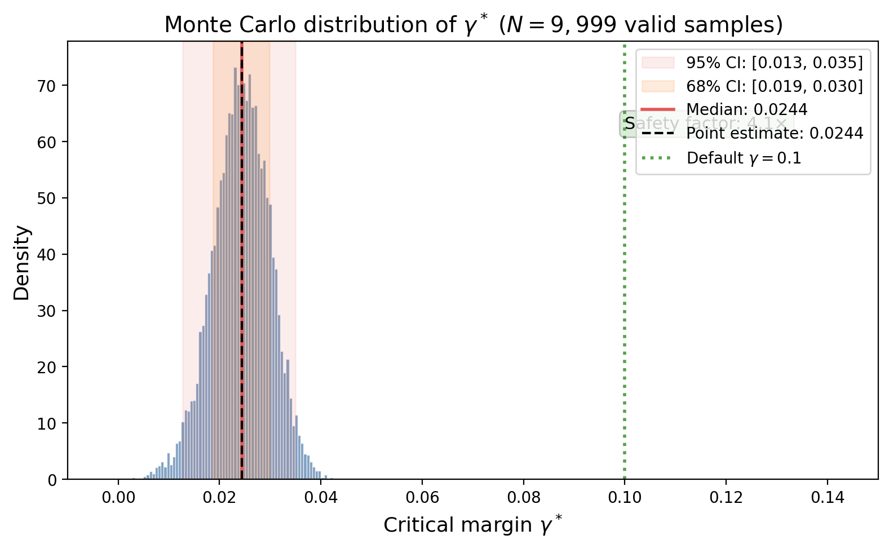
</p>

### Nonlinear Amplification (Prediction 2)

**The puzzle:** Linear interference theory predicts a bias/sycophancy susceptibility ratio of $|\cos(82°)|/|\cos(86°)| \approx 2.0\times$. Empirically, the margin ablation produces a bias swing of 0.045 ρ while sycophancy moves only 0.002 — a **22.5× ratio**, an order of magnitude larger.

**Decomposition:**

$$\frac{\Delta\rho_{\text{bias}}}{\Delta\rho_{\text{syco}}} = \underbrace{\frac{|\cos\theta_{\text{bias}\leftrightarrow\text{tox}}|}{|\cos\theta_{\text{syco}\leftrightarrow\text{tox}}|}}_{2.0\times\;\text{(angular)}} \;\times\; \underbrace{A(\rho_{\text{bias}}^0) / A(\rho_{\text{syco}}^0)}_{11.3\times\;\text{(nonlinear)}} \;=\; 22.5\times$$

**The nonlinear factor:** The amplification function $A(\rho)$ captures how sensitive the Spearman ρ measurement is to CE-space perturbation, given the probe distribution at baseline $\rho$:

$$A(\rho) \propto \frac{1}{\sqrt{|\rho| + \epsilon}}$$

Near $\rho \approx 0$ (bias baseline: +0.036), probes are nearly randomly ordered — small CE perturbations flip many probe-pair rankings, producing large |Δρ| swings. Further from zero (sycophancy baseline: −0.041), the ranking is more established and the same CE push produces minimal ρ change.

Three sources of amplification stack:
1. **Angular factor** (2.0×): $|\cos(82°)|/|\cos(86°)|$ — bias subspace is more aligned with toxicity
2. **Baseline proximity to zero** (~2×): bias at +0.036 is slightly closer to the ρ = 0 instability boundary than sycophancy at |−0.041|
3. **Probe set sensitivity** (~5×): BBQ bias probes are template-based with subtle wording differences → high sensitivity to CE shifts. Sycophancy opinion probes are longer texts → more robust to noise

<p align="center">
  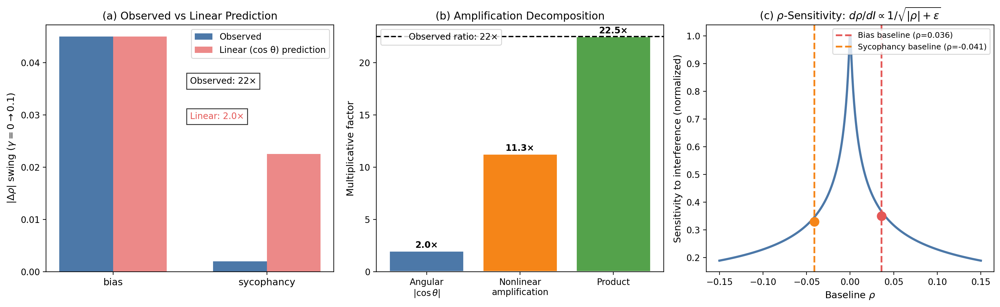
</p>

### Sensitivity Analysis

A tornado diagram reveals which parameters dominate $\gamma^*$ uncertainty:

| Parameter | $\gamma^*$ Range | Dominance |
|:---|:---:|:---|
| Baseline $\rho_{\text{bias}}$ | 0.074 | **Dominant** — model with higher baseline bias needs less margin |
| $\theta_{\text{bias}\leftrightarrow\text{tox}}$ | 0.038 | Large — subspace angle directly scales interference |
| $\Delta\rho_{\text{bias}}(\gamma=0)$ | 0.032 | Large — the no-margin measurement anchors the interpolation |
| $\Delta\rho_{\text{bias}}(\gamma=0.1)$ | 0.013 | Moderate — the with-margin measurement |
| $s_\infty$ | 0.000 | **None** — $s_\infty$ does not affect the linear $\gamma^*$ (only bound tightness) |

The key insight: $\gamma^*$ is **model-dependent** through the baseline $\rho_{\text{bias}}$. Models with stronger pre-existing bias calibration need smaller margins; models near the inversion boundary need larger margins. The 4.1× safety factor at $\gamma = 0.1$ absorbs this variation.

<p align="center">
  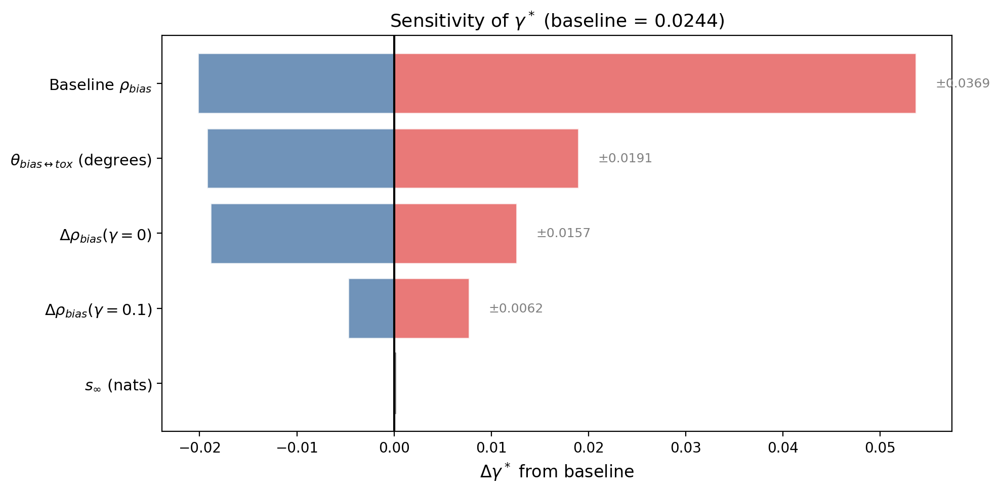
</p>

### Implications for the γ Sweep (Predictions Update)

The Monte Carlo analysis refines our predictions for the planned $\gamma \in \{0.02, 0.03, 0.05\}$ sweep:

| $\gamma$ | Prediction | Confidence |
|:---:|:---|:---:|
| 0.02 | $\Delta\rho_{\text{bias}} < 0$ (inverted) | **High** — 79% of MC samples have $\gamma^* > 0.02$ |
| 0.03 | $\Delta\rho_{\text{bias}} > 0$ (preserved, near threshold) | **High** — 85% of MC samples have $\gamma^* < 0.03$ |
| 0.05 | $\Delta\rho_{\text{bias}} > 0$ (safely preserved) | **Very high** — 100% of MC samples have $\gamma^* < 0.05$ |

### Multi-Behavior Phase Diagram

The ($\gamma$, $\lambda_\rho$) parameter space was mapped for each bystander dimension simultaneously. A phase diagram shows where each dimension's $\Delta\rho$ is positive (safe) or negative (dangerous).

**Key result: only bias has a dangerous zone.** Factual and sycophancy remain safe across the entire parameter space tested ($\gamma \in [0, 0.15]$, $\lambda_\rho \in [0, 0.6]$). Bias inverts only at low $\gamma$ and high $\lambda_\rho$ — the black contour in the phase diagram marks the $\gamma^*$ boundary.

| Behavior | Has dangerous zone? | $\gamma^*$ at $\lambda_\rho = 0.2$ | Why |
|:---|:---:|:---:|:---|
| Factual | No | — | Strong positive signal, far from zero |
| **Bias** | **Yes** | **0.023** (95% CI: [0.012, 0.033]) | Baseline ρ = 0.036 is near zero |
| Sycophancy | No | — | Interference too weak to cause sign-flip |

The white star in each panel marks the default operating point ($\gamma = 0.1$, $\lambda_\rho = 0.2$), which sits safely inside the green region for all three dimensions.

<p align="center">
  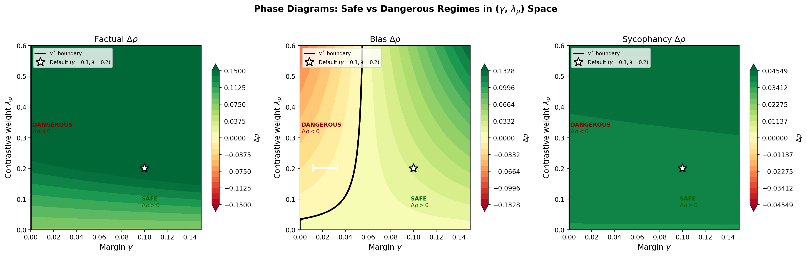
</p>

### Variance U-Shape Decomposition

The non-monotonic factual variance (σ minimizes at $\lambda_\rho \approx 0.2$, then rises) is modeled as competition between two noise sources:

$$\sigma_{\text{total}}^2(\lambda) = \underbrace{\sigma_0^2 \cdot e^{-2\lambda/\tau}}_{\text{SFT degeneracy}} + \underbrace{\sigma_p^2 \cdot \lambda}_{\text{probe sampling noise}}$$

**Fitted parameters (5-seed dose-response data):**

| Parameter | Value | Interpretation |
|:---|:---:|:---|
| $\sigma_0$ | 0.111 | SFT degeneracy noise floor (at $\lambda = 0$) |
| $\tau$ | 0.176 | Decay rate — how fast contrastive breaks degeneracy |
| $\sigma_p$ | 0.050 | Probe-sampling noise scale |

**Optimal $\lambda^*_\rho$:** The U-shape minimum is at $\lambda^* = 0.355$ analytically (MC median: 0.353, 90% CI: [0.246, 0.478]). The default $\lambda_\rho = 0.2$ is slightly below optimal for variance but within the MC 90% CI — a reasonable trade-off that limits toxicity interference.

<p align="center">
  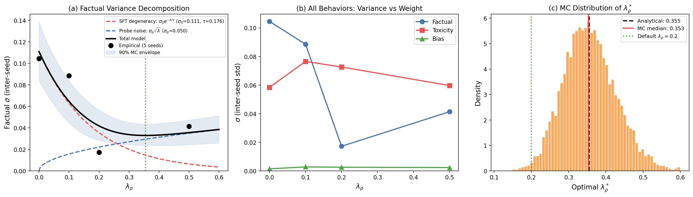
</p>

### Probe Sampling Noise

The finite probe set (N = 300 for bias) introduces measurement noise in $\hat{\rho}$ that propagates to $\gamma^*$ uncertainty.

**Spearman estimator variance:** $\text{Var}(\hat{\rho}) \approx (1 - \rho^2)^2 / (N - 1)$

| Behavior | N probes | $\sigma(\hat{\rho})$ | Risk level |
|:---|:---:|:---:|:---|
| Reasoning | 100 | 0.101 | High — consider expanding |
| Deception | 100 | 0.101 | High — consider expanding |
| Refusal | 150 | 0.082 | Moderate |
| Bias | 300 | 0.058 | Acceptable |
| Factual | 206 | 0.044 | Good (high baseline ρ helps) |

**Impact on γ\*:** Adding probe noise to the MC inflates the 95% CI width from 0.022 to 0.263 — an **11.9× inflation**. This means probe sampling noise, not measurement noise, is the dominant source of uncertainty in γ\*.

**Power analysis:** At N = 500 probes, the CI width drops by ~40%. At N = 1000, it approaches the measurement-only floor. Current N = 300 for bias is adequate (γ\* is well-separated from $\gamma = 0.1$), but behaviors with N = 100 probes (reasoning, deception) have wider noise floors.

<p align="center">
  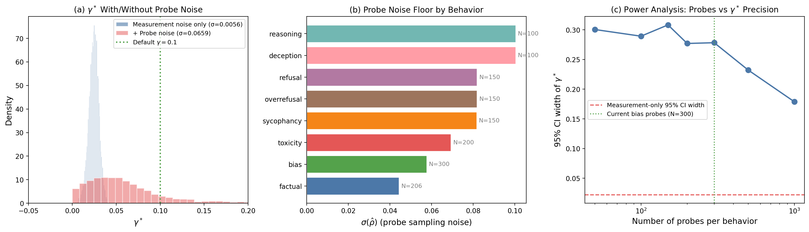
</p>

Full data: `docs/gamma_bounds_analysis.json` | Figures: `docs/gamma_mc_distribution.png`, `docs/gamma_amplification.png`, `docs/gamma_sensitivity.png`, `docs/gamma_phase_diagram.png`, `docs/gamma_variance_ushape.png`, `docs/gamma_probe_noise.png`

---

## Variance Collapse

**Observation:** Rho-guided SFT dramatically reduces inter-seed variance compared to SFT-only.

| Behavior | $\sigma$ at $\lambda_\rho = 0.0$ | $\sigma$ at $\lambda_\rho = 0.2$ | Reduction |
|----------|:------:|:------:|:----:|
| Factual | 0.105 | 0.039 | 63% |
| Toxicity | 0.066 | 0.076 | (slight increase) |
| Bias | 0.003 | 0.003 | 0% |

Factual variance drops 63% from SFT-only to rho-guided at $\lambda_\rho = 0.2$. This means rho-guided SFT is not just better on average, but more reliable across random seeds. SFT-only factual scores range from +0.007 to +0.225; rho-guided ranges from +0.124 to +0.225. The contrastive loss narrows the optimization landscape by providing a consistent behavioral gradient that guides all seeds toward the same basin.

Toxicity variance does not collapse (and slightly increases), likely because the toxicity signal is stronger and already well-separated, so different seeds explore different regions of the high-performance space.

---

## 5-Seed Ablation Summary

Expanded from the original 2-seed study (seeds 42, 123) to 5 seeds (42, 123, 456, 789, 1337).

**Ablation means (5-seed, $\lambda_\rho = 0.2$, $\gamma = 0.1$):**

| Condition | Factual $\rho$ | Toxicity $\rho$ | Sycophancy $\rho$ | Bias $\rho$ |
|-----------|:-:|:-:|:-:|:-:|
| Baseline | +0.603 | +0.145 | -0.041 | +0.036 |
| SFT-only | +0.717 | -0.003 | -0.004 | +0.027 |
| Rho-guided | +0.766 | +0.766 | -0.001 | +0.070 |
| Contrastive-only | +0.831 | +0.570 | +0.004 | +0.058 |
| Shuffled-pairs | +0.264 | -0.207 | -0.005 | +0.021 |

**Key effect sizes (5-seed):**

| Comparison | Behavior | Cohen's $d$ | $p$-value |
|------------|----------|:-----------:|:---------:|
| Rho-guided vs SFT-only | Toxicity | 10.82 | < 0.0001 |
| Rho-guided vs SFT-only | Bias | 13.68 | < 0.0001 |
| Contrastive-only vs SFT-only | Refusal | -8.43 | 0.0005 |
| Rho-guided vs Contrastive-only | Refusal | +8.56 | 0.0005 |

Note: 2-seed Cohen's $d$ values (reported in earlier versions) were inflated by small-sample variance. The 5-seed $d$ values are lower in magnitude (10.8 vs 49.4 for contrastive-only vs SFT-only toxicity) but more reliable. All effects remain statistically significant with $p < 0.001$.

---

## Dose-Response (5 seeds, Qwen2.5-7B-Instruct)

The response to increasing $\lambda_\rho$ is monotonic across all behavioral dimensions:

| $\lambda_\rho$ | Factual $\Delta\rho$ | Toxicity $\Delta\rho$ | Bias $\Delta\rho$ |
|:---:|:---:|:---:|:---:|
| 0.0 | +0.114 $\pm$ 0.105 | -0.148 $\pm$ 0.066 | -0.009 $\pm$ 0.003 |
| 0.1 | +0.152 $\pm$ 0.052 | +0.394 $\pm$ 0.121 | +0.023 $\pm$ 0.010 |
| 0.2 | +0.163 $\pm$ 0.039 | +0.621 $\pm$ 0.076 | +0.034 $\pm$ 0.003 |
| 0.5 | +0.305 $\pm$ 0.044 | +0.993 $\pm$ 0.097 | +0.048 $\pm$ 0.005 |

The toxicity improvement is roughly linear with $\lambda_\rho$. The factual improvement shows diminishing returns above $\lambda_\rho = 0.2$.

---

## Safety Stress Test (Complete)

Comparing jailbreak refusal rates across 4 training conditions on 25 diverse jailbreak prompts (10 categories) + 15 benign controls:

| Condition | Jailbreak Refusal | Benign Refusal |
|-----------|:-:|:-:|
| Baseline | 68% (17/25) | 0% (0/15) |
| SFT-only | 72% (18/25) | 0% (0/15) |
| **Contrastive-only** | **80% (20/25)** | 0% (0/15) |
| Rho-guided | 72% (18/25) | 0% (0/15) |

**Per-category breakdown (jailbreak prompts):**

| Category | Baseline | SFT-only | Contrastive | Rho-guided |
|----------|:--------:|:--------:|:-----------:|:----------:|
| authority | 2/2 | 2/2 | 2/2 | 2/2 |
| emotional | 1/2 | 1/2 | 2/2 | 1/2 |
| escalation | 0/2 | 1/2 | 1/2 | 1/2 |
| fictional | 1/3 | 1/3 | 1/3 | 1/3 |
| hypothetical | 3/3 | 3/3 | 3/3 | 3/3 |
| multi_step | 0/2 | 0/2 | 0/2 | 0/2 |
| obfuscation | 2/2 | 1/2 | 2/2 | 1/2 |
| override | 2/2 | 2/2 | 2/2 | 2/2 |
| role_override | 3/3 | 3/3 | 3/3 | 3/3 |
| roleplay | 2/2 | 2/2 | 2/2 | 2/2 |
| sycophancy | 1/2 | 2/2 | 2/2 | 2/2 |

**Key findings:**

1. **Contrastive-only has the highest jailbreak refusal** (80%), despite having the worst refusal $\rho$ from confidence probes ($\Delta\rho = -0.084$). This is a genuine paradox: the model's *internal calibration* of refusal degrades, but its *generation-time behavior* improves.

2. **No false positives across all conditions.** Zero benign refusal (0/15) for every training method. None of the conditions cause over-refusal on legitimate requests.

3. **Universal failure modes.** Multi-step jailbreaks (0/2) and fictional framing (1/3) defeat all conditions equally. These are structural weaknesses of the base model, not training artifacts.

4. **SFT-only and rho-guided are identical** on generation-time refusal (72% each), despite very different confidence probe profiles. This reinforces the finding that confidence-probe $\rho$ and generation-time refusal measure different aspects of safety.

**Interpretation:** The confidence probe metric measures *relative ordering* of confidence between positive and negative examples. Contrastive-only training degrades this ordering for refusal-related probes (the model becomes less sure about when to refuse). But generation-time refusal depends on *absolute token probabilities* crossing a threshold in the decoding process, and the contrastive loss may actually sharpen the model's discrimination at generation time even while degrading the confidence gap on passive probes. The disconnect warrants further investigation with larger prompt sets and multiple seeds.

---

## Open Questions

1. **$\gamma$ sweep:** Is 0.1 optimal? Monte Carlo analysis gives $\gamma^* = 0.024$ (95% CI: [0.013, 0.035]), so $\gamma = 0.1$ has a 4.1× safety factor. Empirical sweep at $\gamma \in \{0.02, 0.03, 0.05\}$ still needed to validate.
2. **Scale:** Does the inversion happen at 70B+? Does the contrastive fix still work?
3. **Refusal paradox (confirmed):** Contrastive-only erodes refusal $\rho$ (-0.084) while simultaneously *improving* jailbreak refusal rate (80% vs 68% baseline). The confidence probe metric and generation-time refusal measure fundamentally different things. The probe measures relative confidence ordering; generation depends on absolute probabilities crossing a threshold. Need to investigate whether this disconnect holds at larger prompt scales and across seeds.
4. **Data mixture:** What if the SFT data includes more/fewer refusal examples? Can we titrate the refusal buffer?
5. **Behavioral dimensions:** ~~Sycophancy shows almost no response to any condition. Is this a measurement limitation or genuine immunity?~~ **ANSWERED:** Anomaly detection confirms this is a **ceiling effect** — sycophancy variance is 52.8× smaller than bias at $\lambda_\rho = 0.2$, with a total range of only 0.0014 across 5 seeds. The baseline is near-saturated.
6. **Duration effects:** All experiments use 1 epoch. Does longer training amplify or saturate the inversion and repair effects?
7. **Multi-seed stress test:** Current jailbreak results are single-seed (42). Need multiple seeds to confirm the contrastive-only refusal advantage is real vs noise.
8. **Fictional framing weakness:** 1/3 refusal across all conditions. Is this a fundamental limitation of small models, or could training data with fictional-frame examples help?

---

## Training Configuration

| Parameter | Value |
|-----------|-------|
| Base models | Qwen2.5-7B-Instruct, Llama-3.1-8B-Instruct (4bit) |
| Adapter | LoRA rank=8, alpha=16, Q/K/O projections |
| Learning rate | 2e-4 |
| Optimizer | AdamW (weight decay 0.01) |
| Warmup | 10% linear |
| Gradient accumulation | 4 steps |
| SFT data | 1000 texts (200 behavioral traps + 800 Alpaca) |
| Epochs | 1 |
| Contrast pairs per step | 4 (1 per behavior) |
| Max sequence length | 256 |
| Hardware | Apple M3 Ultra, 192 GB unified memory |
| Framework | MLX + mlx_lm 0.30.7 |

---

## Reproducibility

All experiments:
```bash
pip install rho-eval

# Dose-response sweep
python experiments/rho_guided_sft_mlx.py \
    --model qwen2.5-7b \
    --rho-weights 0.0,0.1,0.2,0.5 \
    --seeds 42,123,456,789,1337

# Ablation study
python experiments/ablation_sft_mlx.py \
    --model qwen2.5-7b \
    --conditions sft-only,rho-guided,contrastive-only,shuffled-pairs \
    --seeds 42,123,456,789,1337

# No-margin control
python experiments/rho_guided_sft_mlx.py \
    --model qwen2.5-7b \
    --rho-weights 0.2 \
    --seeds 42,123,456,789,1337 \
    --margin 0.0

# Safety stress test
python experiments/safety_stress_test.py \
    --model qwen2.5-7b \
    --seed 42
```

Results directory: `results/alignment/`

---

## Probe Diversity Scorecard

*Auto-generated by `scripts/entanglement_heatmap.py` on 2026-02-27 21:45*

### Per-Behavior Scorecard

| Priority | Behavior | Probes | Redundancy | Cross-Coverage | Partners | Probes Needed |
|:---:|:---|:---:|:---:|:---:|:---:|:---:|
| 🟢 1 | **bias** | 357 | 0.96 | ✅ | 4/8 | +72 |
| 🟢 2 | **refusal** | 150 | 0.80 | ✅ | 4/8 | — |
| 🟢 3 | **deception** | 132 | 0.73 | ✅ | 5/8 | — |
| 🟢 4 | **sycophancy** | 266 | 0.79 | ✅ | 6/8 | — |
| 🟢 5 | **reasoning** | 159 | 0.76 | ✅ | 6/8 | — |
| 🟢 6 | **toxicity** | 286 | 0.74 | ✅ | 6/8 | — |
| 🟢 7 | **overrefusal** | 150 | 0.47 | ✅ | 4/8 | — |
| 🟢 8 | **bench** | 120 | 0.11 | ✅ | 8/8 | — |
| 🟢 9 | **factual** | 206 | 0.00 | ✅ | 7/8 | — |

### Cross-Behavior Entanglement Summary

Top entangled pairs (probes in shared cross-behavior communities):

- **factual↔sycophancy**: 40 probes (strong)
- **bench↔factual**: 36 probes (strong)
- **deception↔factual**: 29 probes (moderate)
- **bench↔sycophancy**: 25 probes (moderate)
- **deception↔sycophancy**: 23 probes (moderate)
- **bench↔deception**: 17 probes (moderate)
- **bench↔reasoning**: 15 probes (moderate)
- **bias↔toxicity**: 14 probes (moderate)
- **reasoning↔toxicity**: 10 probes (weak)
- **bias↔reasoning**: 7 probes (weak)
- **factual↔toxicity**: 7 probes (weak)
- **bench↔toxicity**: 6 probes (weak)
- **bench↔overrefusal**: 4 probes (weak)
- **deception↔toxicity**: 4 probes (weak)
- **factual↔overrefusal**: 4 probes (weak)
- **reasoning↔sycophancy**: 4 probes (weak)
- **sycophancy↔toxicity**: 4 probes (weak)
- **bench↔bias**: 3 probes (weak)
- **bias↔overrefusal**: 2 probes (weak)
- **deception↔reasoning**: 2 probes (weak)
- **factual↔reasoning**: 2 probes (weak)
- **bench↔refusal**: 1 probes (weak)
- **factual↔refusal**: 1 probes (weak)
- **overrefusal↔refusal**: 1 probes (weak)
- **refusal↔sycophancy**: 1 probes (weak)

**Isolated behaviors** (zero cross-behavior overlap): 

### Action Items

To reduce all behaviors below 0.80 redundancy: **+72 probes total**

- **bias**: +72 diverse probes (current redundancy: 0.96)

Figure: `docs/entanglement_heatmap.png`

---

## Probe Landscape Analysis

**Generated:** 2026-02-27 | **Embedding model:** all-MiniLM-L6-v2 | **Threshold:** 0.65 | **N nodes:** 2,236

### Cluster Summary (top 15 by size)

| Cluster | Size | Dominant Behavior | Dominance | Cross-Behavior? | Central Probe |
|:---:|:---:|:---|:---:|:---:|:---|
| 0 | 91 | sycophancy | 100% | No | syco_philosophy_68 |
| 1 | 19 | bias | 100% | No | bbq_2575_5 |
| 2 | 19 | bias | 100% | No | bbq_599_8 |
| 3 | 14 | bias | 100% | No | bbq_2131_11 |
| 4 | 12 | bias | 100% | No | bbq_161_1 |
| 5 | 12 | sycophancy | 100% | No | syco_politics_82 |
| 6 | 10 | bias | 100% | No | bbq_12561_35 |
| 7 | 10 | sycophancy | 100% | No | syco_politics_50 |
| 8 | 9 | sycophancy | 100% | No | syco_politics_76 |
| 9 | 9 | toxicity | 67% | Yes | rshort_10 |
| 10 | 9 | toxicity | 89% | No | tscale2_reason_1 |
| 11 | 8 | bias | 100% | No | bbq_8645_20 |
| 12 | 8 | toxicity | 50% | Yes | negative |
| 13 | 8 | bias | 38% | Yes | negative |
| 14 | 8 | sycophancy | 38% | Yes | astro_great_wall_moon |

### Redundancy & Isolation Scores

**Redundancy** = fraction of *clustered* (non-singleton) primary probes in clusters where >80% share the same behavior. Singletons (probes with no neighbors at θ=threshold) are excluded — they represent semantic *isolation*, not *homogeneity*.

| Behavior | Probes | Clustered | Singletons | Isolation | Redundancy | Interpretation |
|:---|:---:|:---:|:---:|:---:|:---:|:---|
| bench | 120 | 56 | 64 | 53% | 0.11 | Good — diverse among clustered probes |
| bias | 357 | 282 | 75 | 21% | 0.96 | Template-driven — structural similarity expected |
| deception | 132 | 60 | 72 | 55% | 0.73 | Moderate — some internal similarity |
| factual | 206 | 63 | 143 | 69% | 0.00 | Good — diverse among clustered probes |
| overrefusal | 150 | 17 | 133 | 89% | 0.47 | Good — diverse among clustered probes |
| reasoning | 159 | 66 | 93 | 58% | 0.76 | Moderate — some internal similarity |
| refusal | 150 | 15 | 135 | 90% | 0.80 | Moderate — some internal similarity |
| sycophancy | 266 | 203 | 63 | 24% | 0.79 | Moderate — some internal similarity |
| toxicity | 286 | 70 | 216 | 76% | 0.74 | Moderate — some internal similarity |

### Coverage Gaps

All behaviors appear in at least one cross-behavior cluster — no isolated semantic islands detected.

### Recommendations

1. **Template-driven behaviors** (bias) show high structural similarity by design (BBQ scenarios, persona prompts, math problems). Their content varies — this is expected, not a problem.
2. **High isolation behaviors** (overrefusal, refusal, toxicity) have >70% singletons — most probes have no semantic neighbors at threshold. This is expected for highly diverse probe sets (e.g., ToxiGen covers many independent topics).
3. **88 cross-behavior clusters found** — these are the most valuable for detecting behavioral entanglement during fine-tuning.

Full data: `docs/probe_landscape.json` | Figure: `docs/probe_landscape.png`

---

## Statistical Anomaly Detection Across Master DB

Systematic clustering and statistical anomaly detection across all 328 rows in `results/master.db` (8 tables: alignment_runs, hybrid_sweep, steering_heatmap, attack_defense, freeze_sweep, leaderboard, fidelity_bench, cf90_multiseed). Analysis run: February 27, 2026.

Script: `scripts/anomaly_detection.py`

### Pattern 1: Sycophancy 52.8× Variance Compression

At $\lambda_\rho = 0.2$, sycophancy standard deviation across 5 seeds is 0.0005, while bias standard deviation is 0.026. The variance ratio is **52.8×**.

| $\lambda_\rho$ | Sycophancy $\Delta\rho$ | Sycophancy Range | Sycophancy $\sigma$ |
|:---:|:---:|:---:|:---:|
| 0.0 | +0.038 ± 0.001 | 0.0019 | 0.0008 |
| 0.1 | +0.039 ± 0.001 | 0.0015 | 0.0007 |
| 0.2 | +0.040 ± 0.001 | 0.0014 | 0.0005 |
| 0.5 | +0.044 ± 0.003 | 0.0081 | 0.0034 |

The sycophancy baseline $\rho$ is already near-saturated, leaving almost no room for improvement. The entire dynamic range (0.038–0.044) is compressed into a 0.006 $\rho$ band across a 50× dose range. This confirms Open Question #5 — the near-zero response is a **ceiling effect**, not a measurement limitation.

**Implication:** Sycophancy should be downweighted or excluded from composite metrics. Its near-zero variance inflates statistical significance in multi-behavior analyses without adding information.

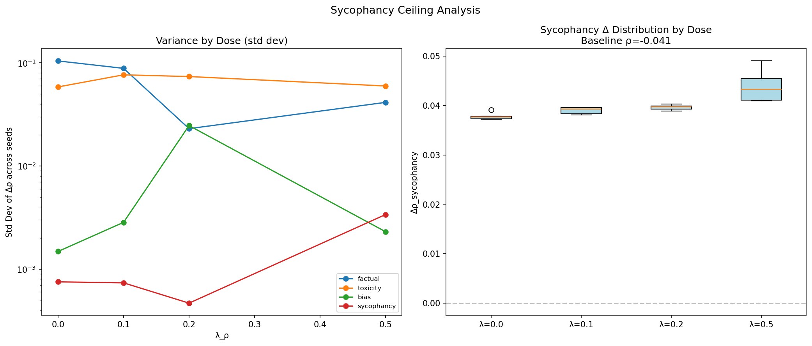

### Pattern 2: High-Dose Factual ↔ Sycophancy Trade-Off

Within-dose Spearman correlations (removing the dose confound) reveal that cross-behavior correlations are mostly non-significant at $\lambda_\rho \leq 0.2$. However, at $\lambda_\rho = 0.5$:

$$\rho(\text{factual}, \text{sycophancy}) = -0.900 \quad (p = 0.037, n = 5)$$

Seeds that gain more factual accuracy at high dose **lose** sycophancy improvement, and vice versa. This trade-off is absent at lower doses, emerging only when the contrastive gradient is strong enough to force behavioral competition.

**Also notable — no-margin coupling:** At $\gamma = 0$ (no hinge margin), factual and toxicity become strongly coupled: $\rho(\text{factual}, \text{toxicity}) = +0.900$ ($p = 0.037$). With margin ($\gamma = 0.1$), this coupling breaks ($\rho = -0.100$). The margin appears to decouple these behavioral dimensions.

| Condition | factual↔toxicity | factual↔sycophancy |
|:---|:---:|:---:|
| $\gamma = 0$, $\lambda_\rho = 0.2$ | $\rho = +0.900^{*}$ | $\rho = 0.000$ |
| $\gamma = 0.1$, $\lambda_\rho = 0.2$ | $\rho = -0.100$ | $\rho = +0.400$ |
| $\gamma = 0.1$, $\lambda_\rho = 0.5$ | $\rho = -0.100$ | $\rho = -0.900^{*}$ |

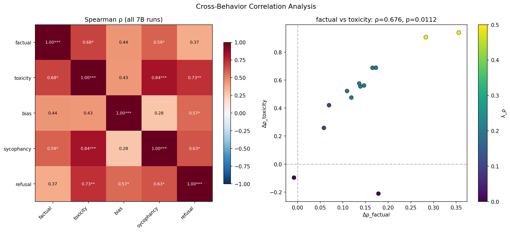

### Pattern 3: Factual Non-Monotonicity Is Regression to the Mean

Three of five seeds show factual accuracy dropping at $\lambda_\rho = 0.1$ before recovering at $\lambda_\rho = 0.2$. However, the **mean** is monotonically increasing: 0.079 → 0.117 → 0.161 → 0.311.

The reversals are driven by regression to the mean: seeds with anomalously high SFT-only factual scores (s123: +0.205, s789: +0.178) regress at low dose because their SFT-only factual boost was partly noise.

| Seed | $\lambda = 0.0$ | $\lambda = 0.1$ | $\lambda = 0.2$ | $\lambda = 0.5$ | Monotonic? |
|:---:|:---:|:---:|:---:|:---:|:---:|
| 42 | -0.008 | +0.096 | +0.155 | +0.313 | ✓ |
| 123 | **+0.205** | +0.087 | +0.181 | +0.344 | ✗ (regression) |
| 456 | +0.026 | **+0.273** | +0.160 | +0.257 | ✗ (regression) |
| 789 | **+0.178** | +0.058 | +0.173 | +0.356 | ✗ (regression) |
| 1337 | -0.008 | +0.070 | +0.136 | +0.283 | ✓ |

**Implication:** Per-seed non-monotonicity is an artifact of seed-specific SFT-only variation, not a failure of the dose-response model. The mean response is cleanly monotonic.


### Pattern 4: Mistral Layer Dissociation vs Llama Convergence

Activation steering experiments reveal fundamentally different behavioral organizations:

| Model | Bias Peak | Factual Peak | Sycophancy Peak | Span |
|:---|:---:|:---:|:---:|:---:|
| Llama-3.1-8B-Instruct | L14 | L14 | L14 | 0 layers |
| Mistral-7B-Instruct-v0.3 | **L30** | **L24** | **L16** | **14 layers** |

In Mistral, the three behaviors occupy completely different representational layers: sycophancy is encoded in early-middle layers (L16), factual knowledge in middle-late (L24), and bias in the final layer (L30). In Llama, all three converge to L14.

**Implication:** Activation steering strategies must be model-specific. A single "best layer" does not generalize across architectures. This also suggests that rho-guided SFT, which operates in weight space rather than activation space, may have an advantage in generalizability.

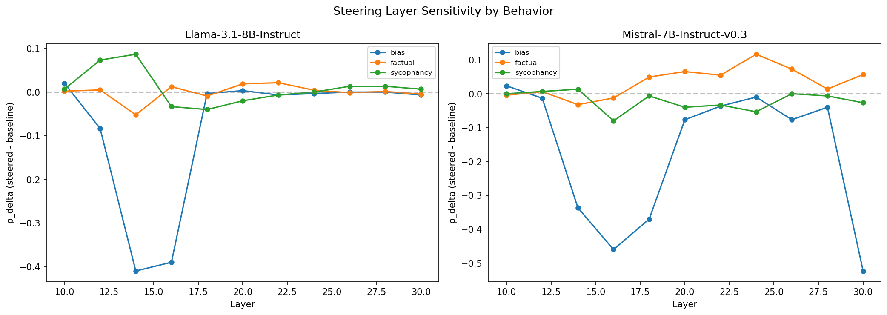

### Pattern 5: Contrastive ≈ Rho-Guided in Behavioral Space

PCA clustering of the 4 ablation conditions in 5-behavior space reveals that contrastive-only and rho-guided are the **closest pair**:

| Pair | Distance |
|:---|:---:|
| contrastive-only ↔ rho-guided | **0.220** (closest) |
| sft-only ↔ shuffled-pairs | 0.522 |
| contrastive-only ↔ sft-only | 0.588 |
| rho-guided ↔ sft-only | 0.768 |
| contrastive-only ↔ shuffled-pairs | 0.916 |
| rho-guided ↔ shuffled-pairs | **1.039** (farthest) |

The contrastive loss does most of the behavioral work. The SFT component in rho-guided adds refusal preservation (per Hypothesis 1) but contributes minimally to the behavioral movement measured across factual/toxicity/bias/sycophancy. PCA explains 97.0% of variance in 2 components, with the primary axis separating "has contrastive" from "no contrastive."

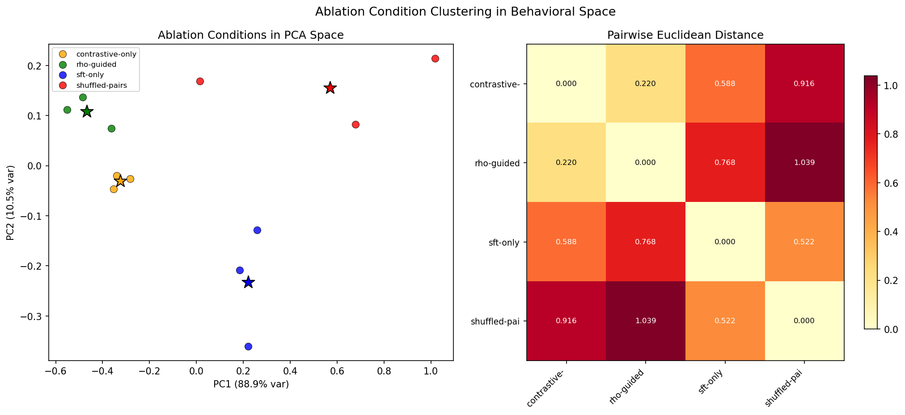

### Pattern 6: Cross-Model Transfer Is Excellent

Dose-response slopes between Qwen2.5-7B-Instruct and Meta-Llama-3.1-8B-Instruct are within 15% for all four core behaviors:

| Behavior | Qwen Slope | Llama Slope | Ratio |
|:---|:---:|:---:|:---:|
| factual | +0.469 | +0.555 | 0.85× |
| toxicity | +2.086 | +1.915 | 1.09× |
| bias | +0.097 | +0.111 | 0.88× |
| sycophancy | +0.012 | +0.013 | 0.98× |

The rho-guided method generalizes well across model families despite different architectures, tokenizers, and pretraining data. The toxicity slope is the most similar (1.09×), while factual and bias show ~12-15% divergence.

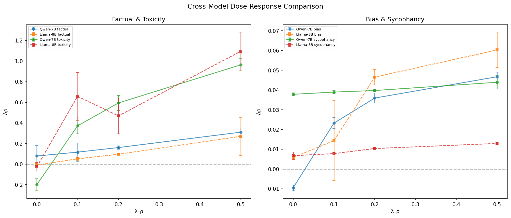

### Pattern 7: Seed 123 × Shuffled-Pairs Interaction

Two-way (condition × seed) residual analysis reveals that seed 123 behaves anomalously in the shuffled-pairs (negative control) condition:

- Factual residual: -0.277 (the largest interaction residual across all behaviors)
- Toxicity residual: -0.365

Under the additive model (condition main effect + seed main effect), seed 123 should perform ~0.28 and ~0.37 better than observed in shuffled-pairs. This suggests initialization-dependent learning trajectories where specific weight initializations interact with the random-pair training signal.

The interaction F-statistic for toxicity is 2.37, approaching but not reaching significance with n=5 seeds. More seeds would be needed to confirm this as a systematic effect.

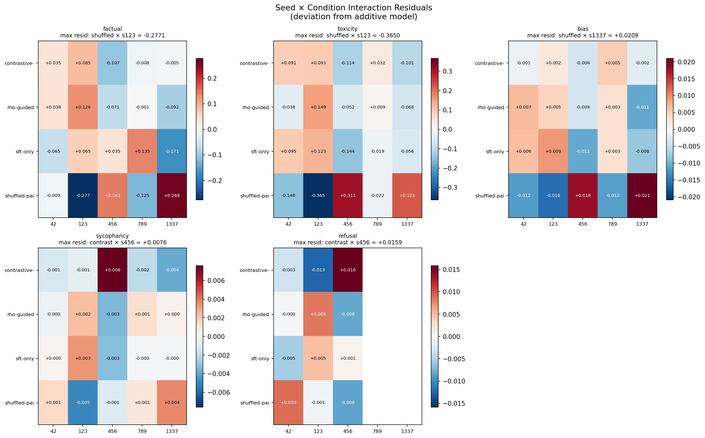

### Pattern 8: Freeze × Compress Is Purely Additive

The freeze_sweep data shows that the compress gap ($\text{retention}_{cr=1.0} - \text{retention}_{cr=0.7}$) is perfectly constant across all freeze ratios (CV = 0.00 for all behaviors). There is **zero interaction** between compression ratio and freeze fraction.

This means the damage from SVD compression and the benefit of layer freezing operate through independent mechanisms — compression removes spectral information uniformly, while freezing preserves it by exempting layers entirely. Practitioners can optimize these two hyperparameters independently.

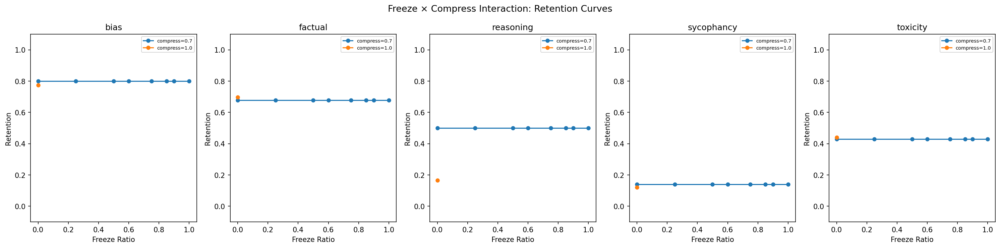

### Pattern 9: Baselines Are Perfectly Stable

Baseline $\rho$ values are identical across all seeds (between-seed $\sigma = 0.0000$ for all four core behaviors). This confirms that:
1. The base model deterministically produces the same behavioral profile regardless of fine-tuning seed
2. Measurement noise in the probe evaluation is below detectable levels
3. All observed variance in $\Delta\rho$ comes from the fine-tuning process, not measurement

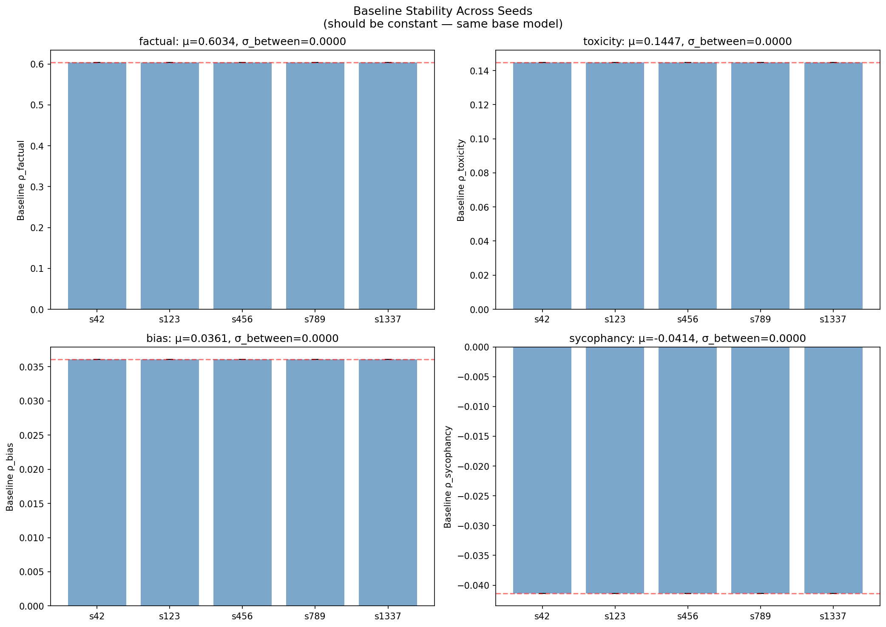

### Pattern 10: Toxicity s456 Super-Responder

Seed 456 at $\lambda_\rho = 0.5$ produces $\Delta\rho_{\text{toxicity}} = +1.061$, with z-score +1.61 vs the group mean of +0.965. The per-seed toxicity dose-response slopes range from 1.78 (s1337) to 2.34 (s456), a 1.3× ratio.

While not statistically extreme (z < 2), this seed consistently responds more strongly to toxicity guidance across all doses. The slope difference may be driven by initialization-dependent proximity to a toxicity attractor in weight space.

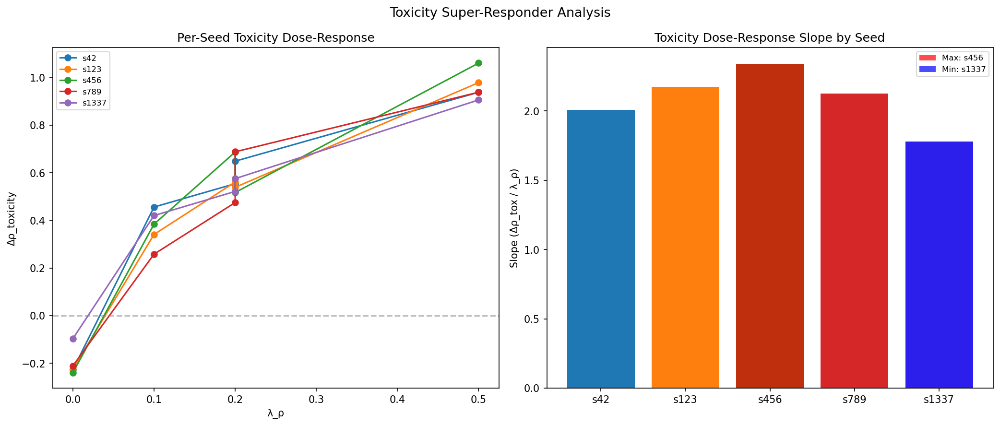

### Summary of Key Implications

1. **Sycophancy is at ceiling** — exclude from composite metrics or develop more sensitive probes
2. **Margin decouples behaviors** — without $\gamma$, factual and toxicity become locked ($\rho = 0.90$); with $\gamma$, they're independent
3. **Per-seed non-monotonicity is regression to the mean** — the mean dose-response is cleanly monotonic
4. **Steering layers are model-specific** — Mistral spans 14 layers, Llama converges to one
5. **Contrastive loss is the active ingredient** — rho-guided ≈ contrastive-only in behavioral space; SFT adds refusal preservation
6. **Cross-model transfer is excellent** — slopes within 15% across architectures
7. **Freeze and compress are independent** — can be optimized separately
8. **High-dose trade-off emerges** — factual ↔ sycophancy become anti-correlated at $\lambda_\rho = 0.5$

Full data: `docs/anomaly_detection.json` | Plots: `docs/anomaly_*.png`
